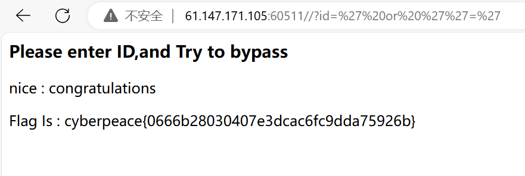

想在不知道账号密码的情况下成功登录网页？快来试试万能密码吧！

<!-- more -->

## 前言

这几天在尝试学习CTF中Web方向的相关知识，这次是想要记录一下有关于**万能密码**这一方面的知识要点。

### 1.万能密码原理

 

要弄懂万能密码的原理，我们必须了解以下三个要点：

   - 由原理可知，用户进行用户名和密码验证时，网站需要查询数据库。查询数据库就是执行SQL语句。
    验证登陆所执行的SQL语句如下：

        ` SELECT * FROM admin WHERE Username='用户名' AND Password='密码' `

   - 第二，我们还需要了解payload提交的原理:
    假如我们payload提交的是 **id=123**，而到后端大概会呈现出来的部分内容就是 **'id=123'**。也就是说后端会自动给我们的payload添加一个**单引号**。

   - 第三，SQL语句执行的优先级为：or<and<not，同一优先级默认从左往右计算。

### 2.实例详解

这道题是一道新手题，**攻防世界-inget**

 

题目**inget**就告诉我们大概是与SQL有关的题型。其次Web网页中提示 “Please enter ID,and Try to bypass” ，让我们输入ID并尝试绕过登录验证，另一个暗藏的意思就是密码不需要我们去验证（这也是我为什么选这个作为一个简单实例展开）。

既然不需要密码，那我们就简化要点1中要执行的SQL语句

如下：` SELECT * FROM admin WHERE Username='用户名' `

这里我们构造一个payload: <u>/?id=<mark>' or> ''='</mark></u>

当我们提交时，<u>/?id=<mark>' or ''='</mark> </u> 中的 <mark>' or ''='</mark> 的替换掉SQL语句中的**用户名**

结果如下：` SELECT * FROM admin WHERE Username='' or ''='' `

依据or<and<not(=)的优先级，上面的SQL语句被引号划分为两部分，分别为：

第一部分: **SELECT * FROM admin WHERE Username= ''**     （布尔值为**False**）

第二部分：**''=''**     （布尔值为**True**）

第一二部分由**or**相连，进行或运算。 **False or True = True**

因此成功绕过登录，得到flag！

 

### 3.实例拓展

上面的示例毕竟毕竟是特殊情况，只需要通过输入ID来绕过，所以我们刚才 id= <mark>' or ''='</mark> 这个万能密码只适用于特殊情况。

我们能否能够解决需要同时输入ID和PASSWORD的难题？

假设我们这次要同时提交ID和PASSWORD，登录要执行的SQL语句为 ` SELECT * FROM admin WHERE Username='用户名' AND Password='密码' `

这一次我构造payload为 <u>/?id=<mark>1' or 1=1 or '1'='1</mark>&password=abcdef</u>

我这次的万能密码即为<mark>1' or 1=1 or '1'='1</mark> ，密码我则是随便填的。提交payload，id和password分别替换SQL语句中的用户和密码。

结果如下: ` SELECT * FROM admin WHERE Username='1' or 1=1 or '1'='1' AND Password='abcdef' `

依据or<and<not(=)的优先级,同一优先级默认从左往右计算。
1. 上面'1'='1' AND Password='abcdef’**先计算**肯定返回False,因为密码是我们乱输入的。(此处是**False**)
2. Username='1' 返回假,没有用户名是1(此处是**False**)
3. 1=1返回真(此处是**True**)

以上的结果是: **False or True or True 返回 True**。验证通过。

## 结语
以上万能密码只是我挑出来的几个，实际上还有非常多种。

弄懂万能密码，最重要的就是要把握我上述所述的<mark>三个要点</mark>。
