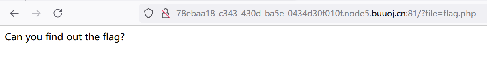
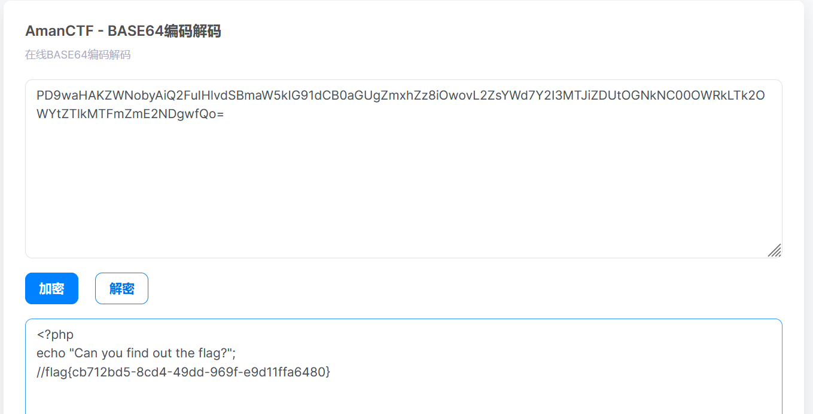

## 前言

这篇博客是关于php伪协议中filter过滤器的运用，是我在做攻防世界Web新手题Include 1 学习到的新知识。

下面我将从题目来引出知识点。

### 1.[ACTF2020 新生赛]Include 1

题目如下，

 

点击tips后，

 

经过代码审计，抓包等方法都没什么线索

最后看了看别人的WP，然后就学习到了PHP伪协议的知识点

思路是构建一个payload,payload如下：
**file=php://filter/read=convert.base64-encode/resource=flag.php**

**这个payload的作用，用人话来说，就是将flag.php文件进行base64加密（就这么简单）。**

**为什么要加密呢？因为通过base64加密后的php代码，是无法进行运行的，我们再进行base64解密，就可以得到php文件的源代码了，包括注释的内容都一一可以解码得出。**

提交payload后结果如下，得到base64编码

 

解密即可得到PHP源代码，正好注释里面就藏了flag

 

flag{cb712bd5-8cd4-49dd-969f-e9d11ffa6480}

### 2.payload的分析与理解

**file=php://filter/read=convert.base64-encode/resource=flag.php**

刚才我们已经展示了这个payload的作用，就是把指定的文件进行base64加密，阻断代码的运行，再进行base64解密得到源代码。

现在我们具体分析该payload的各个部分，以便更好的理解。

 

该payload可以分为四个部分：
   1. 第一部分是格式，表示我要使用PHP伪协议中的filter功能
   2. 第二部分是是可选参数，有read和write，字面意思就是读和写
   3. 第三部分是选择过滤器。主要有四种：字符串过滤器，转换过滤器，压缩过滤器，加密过滤器。filter里可以用一或多个过滤器（中间用|隔开），这也为解题提供了多种方法，灵活运用过滤器是解题的关键。这里的过滤器是把文件flag.php里的代码转换（convert）为base64编码（encode） 
   4. 是必选参数，后面写你要处理的文件名

除了base64加密的过滤器方案，这里举例出其他一些过滤器类别以及对应的功能（更多的可以自行查找）：
   1. 字符串过滤器（该类通常以string开头，对每个字符都进行同样方式的处理）
       - string.rot13   ：一种字符处理方式，字符右移十三位
       - string.toupper ：将所有字符转换为大写。
       - string.tolower ：将所有字符转换为小写。
       - string.strip_tags ：这个过滤器就比较有意思，用来处理掉读入的所有标签，例如XML的等等。在绕过死亡exit大有用处。   
   2. 转换过滤器(对数据流进行编码，通常用来读取文件源码)
       - convert.base64-encode & convert.base64-decode ：base64加密解密
       - convert.quoted-printable-encode & convert.quoted-printable-decode  ：可以翻译为可打印字符引用编码，使用可以打印的ASCII编码的字符表示各种编码形式下的字符。
  
这里我尝试是使用一下string.toupper（将所有字符转换为大写），看看在这道例题里会变成什么样子。模仿刚才payload的形式，使用**string.toupper**功能的paylaod如下：

**file=php://filter/read=string.toupper/resource=flag.php**

传入payload后，页面如下：

  

可以看到英文全部变成大写了，不过并没有展示出源代码。原因是因为修改字符串的大小写并不会阻碍php代码的运行。

## 结言

本篇博客为**PHP伪协议1**，只细讲了**PHP伪协议中的filter功能**。有兴趣的兄弟可以自行了解更多知识，后面有机会我会去讲讲利用**PHP伪协议绕过死亡exit的内容。**
