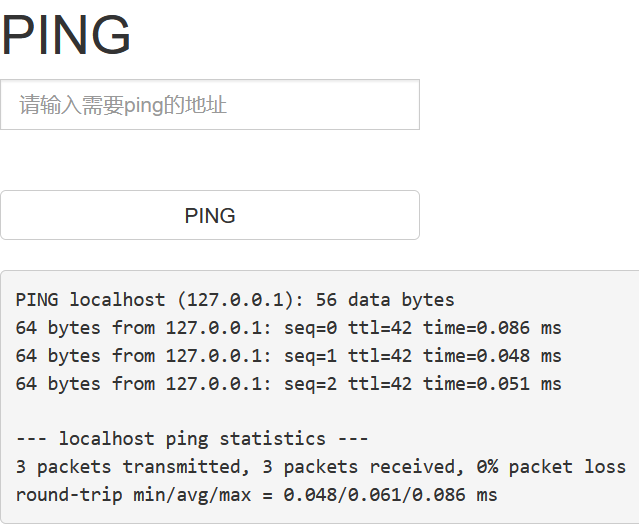
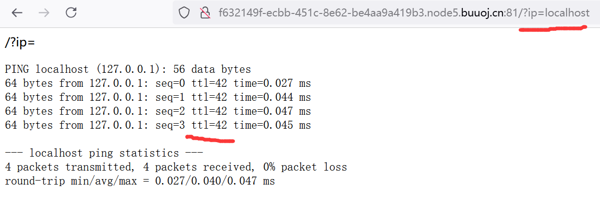

## 前言

这一篇博客我本来是想放在命令执行漏洞那一篇博客中的，后来想想要讲的内容实在是太多了，遂放弃，独自开了一篇文章，用于补充Ping相关的知识，为命令执行漏洞那一片博客作个铺垫先。

这篇文章的内容主要是关于**如何通过Ping判断CTF题目中靶机的系统（这是利用命令执行漏洞的前提），同时讲讲输入ip后Ping返回的内容是什么。**

### 一、 如何判断靶机的命令执行漏洞属于哪个系统？

在CTFweb题中，我们要利用命令执行漏洞，让靶机的系统本地执行命令，那我们就肯定要知道靶机是哪个系统，这样我们才能传输对应的系统命令。

那么如何判断靶机的系统呢？

这里在CSDN中找到了一个方法[如何判断靶机的系统?](https://blog.csdn.net/ningyanggege/article/details/119886469)

里面比较重要的方法有两个：

1. linux大小写敏感,windows大小写不敏感。-----已经测试证实
2. **ping服务器，返还得TTL值不一样，windows一般在100以上，linux一般是100一下**。—已经测试证实通过测试。**ping linux内网机器的ttl为64，ping window内网机器的ttl为126**

一般在CTF做题，遇到和Ping有关的题目时候，我们常常采用第二种方法来判断靶机的系统。

**方法就是传输本机ip进行测试，即传入localhost或是127.0.0.1，然后看看是网站否有回应。如果有回应，则观察回应的ttl数值，大于100则为windwos系统；小于100则为linux系统。**

#### 1. 例题测试

这里我用BUUCTF中[ACTF2020 新生赛]Exec1与[GXYCTF2019]Ping Ping Ping1这两道题进行测试，看看我们这个方法是否正确。

##### 1.1 [ACTF2020 新生赛]Exec1

先是[ACTF2020 新生赛]Exec1这道题。

<div align=center></div>

我们输入localhost进行传输，当然你想用127.0.0.1也行。我们看看网页会回应什么东西。

<div align=center></div>

可以看到网页给我们返回了**靶机本地ip**的有关信息。同时我们还可以看到信息返回了3次，等下我会讲讲为什么会返回三次。

我们先注意观察TTL的数值，可以看到三次回应全部都**小于100**，所以很明显，靶机的系统是linux系统。

##### 1.2 [GXYCTF2019]Ping Ping Ping1

我们在看看这一道题

<div align=center></div>

这里要进行get参数的传参，传入的参数就是ip，那我们就构造paylaod：?ip=localhost，传入localhost来进行测试一下。

<div align=center></div>

可以看到这一次返回的ttl数值还是**小于100**，所以靶机的系统是linux系统。但是这次返回了4次结果，和刚才那道题的3次不一样，等一下我来解释为什么。

通过上面的举例，我们知道了这两道题的靶机系统都是linux系统。

<U>后面如果我们要利用命令执行漏洞，我们就可以参考linux系统的目录结构（根目录之类的），以及linux的路径方式，来获取想要的东西，比如flag。而且我们要注入的命令也是linux的命令，比如ls、cat、cd之类的。</u>

**所以说弄清楚靶机是什么系统是非常重要的**。CTF靶机的系统一般是linux系统。

### 二、 为什么不同靶机返回信息的次数有所不同？

很明显，这与服务器的后端的代码有关。

我们CTF靶机的服务器，所使用的代码一般是PHP

下面是服务器后端用来返回ip相关信息的简化php代码：

```
<?php
    $ip = $_GET['ip'] ;
    // 接收传入的ip参数
    $a = shell_exec('ping -c 4' . $ip);
    // 用shell_exec函数执行系统命令，并用变量a接收返回值
    echo '<pre>';
    // 打印html的一个<pre>标签
    print_r($a);
    // 打印出变量a接受的返回值，即ip相关的信息
?>
```

这里要重点解释一下**ping -c 4** 是什么意思。

**ping 域名** 是linux系统的一个命令，用来返回与域名相关的信息。在liunx下使用ping命令,如 **ping www.baidu.com**,会一直ping 不会停止，这会使你不得不使用ctrl+c强制中断命令.

若想使**ping 命令**像windows下的一样只ping 4次，则可以用-c 指定次数, 如**ping -c 4 www.baidu.com**.

也就是说 **ping -c 数字 域名**，对于这个命令，我们可以**指定次数**来返回**指定域名**的相关信息。

所以说上面的两道例题中，第一道返回了3次结果，而第二道题返回了4次结果，原因就是 **ping -c 后面的数字**设置的不同。

所以说，`shell_exec('ping -c 4' . $ip);`这段代码，就是让系统执行`ping -c 4 传入的ip`这个命令。所以我们可以在网页上看到输出的结果。

<u>因此，我们的Ping的命令执行漏洞，重点就是要利用好  `shell_exec('ping -c 4' . $ip);` 这一段代码。修改payload来使得该代码，变成一段能够执行特殊功能语句。这便是Ping命令执行漏洞的精髓。</u>

而某些php后端代码会对传入的payload进行特殊字符过滤，从而避免命令执行漏洞。如何绕过这些过滤代码，就是解题的关键所在。

## 结语

看完了这一篇博客，记得看看另一篇Ping命令执行漏洞实战的博客，我相信通过这两篇文章，你绝对能够对Ping命令执行漏洞这一知识点有更加深刻的认识。（因为这篇文章本来就应该是和另一篇一起的，只是我想多水一篇0.0）
