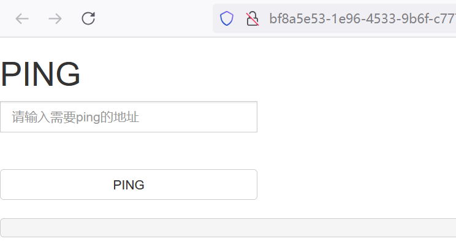
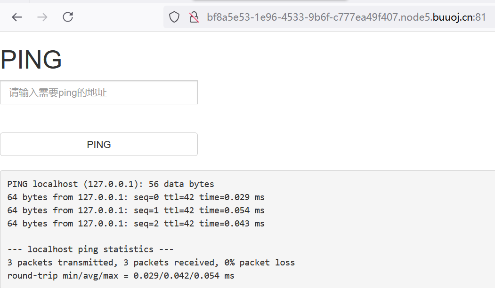
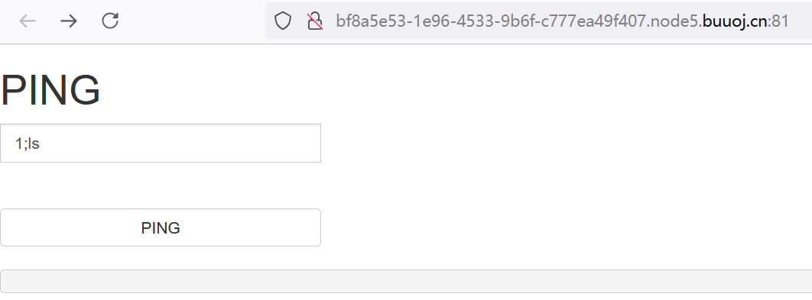

Ping命令执行漏洞1：什么是命令执行漏洞？怎么利用命令执行漏洞？

<!-- more -->

## 前言
看这一篇文章之前，请你一定要先把另一篇文章**Ping与靶机系统**看一遍，该文章为本次博客提供了一些有关的理论基础，如果对某些知识点有所遗漏，将会使这篇文章阅读难度加大。

这一篇博客是有关于**命令执行漏洞**的文章，是对BUUCTF中[ACTF2020 新生赛]Exec1与[GXYCTF2019]Ping Ping Ping1这两道题的一次笔记总结。这次文章内容较多，篇幅较长，希望读者能够耐心看完。

### 一、什么是命令执行漏洞

#### 1. 命令执行漏洞的定义
   
这是我在网上找到一个定义：

命令注入（又叫操作系统命令注入，也称为shell注入）是指在某种开发需求中，需要引入对系统本地命令的支持来完成某些特定的功能。当未对可控输入的参数进行严格的过滤时，则有可能发生命令注入。攻击者可以使用命令注入来执行系统终端命令，直接接管服务器的控制权限。它允许攻击者在运行应用程序的服务器上执行任意操作系统命令，并且通常会完全破坏应用程序及其所有数据。

看起来有点晦涩难懂，我的理解是：**通过传入一段特定的语句，来使得系统本地执行某个命令。（注意我这里说的是执行某个命令）**

#### 2. 命令执行漏洞和SQL注入漏洞有什么区别？

我们之前提高过有关SQL注入漏洞的某些知识点。在某种程度上，命令执行漏洞和SQL注入漏洞都是注入一段特定的语句，在这个方面上确实有一定的相似。

但我认为，这两者不同的地方在于：**命令执行漏洞的目的是想让系统执行某个命令，包括但不限于让系统查看某个文件的内容；而SQL注入漏洞的目的是想绕过SQL数据库的验证系统，从而能够获取数据库的重要数据。**

### 二、命令执行漏洞必备技巧

要想利用命令执行漏洞，我们必须掌握一些技巧，这里说几个最重要的。

#### 1. 必备技巧1：命令连接符

Windows和Linux都支持的命令连接符

**windwos中：**
   - `` cmd1 `|` cmd2 `` 只执行cmd2
   - `` cmd1 `||` cmd2 `` 只有当cmd1执行失败后，cmd2才被执行
   - ` cmd1 & cmd2 ` 先执行cmd1，不管是否成功，都会执行cmd2
   - ` cmd1 && cmd2 ` 先执行cmd1，cmd1执行成功后才执行cmd2，否则不执行cmd2

**Linux还支持分号:**
   - ` cmd1 ; cmd2 ` 按顺序依次执行，先执行cmd1再执行cmd2 
   - `` cmd1 `|` cmd2 `` 作为管道符，将‘|’前面命令的输出作为'|'后面的输入。如果其中一个命令出现错误，后续命令不会继续执行。
   - `` cmd1 `||` cmd2 `` 如果前一条命令为真，则后面的命令不会执行；如果前一条命令为假，则继续执行后面的命令。如果其中一个命令出现错误，后续命令不会继续执行。
   - ` cmd1 & cmd2 ` 同时执行多条命令，不管命令是否执行成功。如果其中一个命令出现错误，不影响其它命令的执行。
   - ` cmd1 && cmd2 ` 按照先后顺序执行命令。每个命令都会在前一个命令执行完毕后立即执行。当碰到执行错误的命令时，将不再执行后面的命令。
 
 最常用的就是分号 `;` 和管道符 `|` 。这两者可以让我们在命令执行漏洞中游刃有。值得注意的是，`|`**前面命令的输出作为后面命令的输入这一特点，可以有发挥的余地**，后面实战我会讲讲。

#### 2. 必备技巧2：特殊字符代替空格(绕过空格)

在**Ping与靶机系统**这一章节我们说过，有一些服务器后端会对传参进行过滤，以此来避免命令执行漏洞。<u>而空格符常常就是后端代码过滤的一个字符，所以我们必须用特殊的字符来代替空格符，从而绕过过滤代码。</u>

以下是一些常见的特殊字符，可以用来代替空格符：
   - ` < ` 
   - ` <> `
   - ` $IFS `
   - ` ${IFS} `
   - ` $IFS$9 `    9可以换成任何一个数字
   - ` %09 `

好的，掌握了以上两个技巧，就可以做一些<u>新手级别</u>的Ping命令执行漏洞题型了。更难的题还需要更加丰富的知识和经验，我相信各位经过不断的训练也能够一一解决。

理论学完了，接下来我将用实战讲解来巩固知识点。

### 三、实战讲解

#### 1. [ACTF2020 新生赛]Exec1

我们先从简单的题来开始，这道题简单就简单在没有**特殊符号过滤**这一难点。

先传入localhost测试靶机的系统

返回的**ttl小于100**，因此靶机的系统为linux

我们先利用**必备技巧1：命令连接符**，利用linux中的` cmd1 ; cmd2 `这个技巧。

我们传入 **1;ls**  （这前面里的数字可以是任何一个，甚至不填都行，后面的ls就是linux的一个命令，即列出当前目录下的文件）

记得我们**Ping与靶机系统**那一篇里面讲的，我这里就不重复了。靶机的后端有一个非常关键的代码，这里举一个大概的例子。

就是：`shell_exec('ping -c 3' . $ip);`

当我们用 **1;ls** 替换掉 `shell_exec('ping -c 3' . $ip);` 中的 ` $ip `。

<u>原语句就会变成  ` shell_exec('ping -c 3' . 1;ls); ` (这里面的 ` . ` 是PHP语言连接字符串的符号)。拼接后就是 ` ping -c 3 1;ls ` （仔细看其实就是 **cmd1;cmd2** 结构）</u>

<u>也就是说，我们让系统执行了一个命令，即 先 ` ping -c 3 1 ` 返回与ip地址为1的有关信息，而且是返回3次;再执行另一个命令 ` ls ` ，列出当前目录下的文件。</u>

执行一下，我们看看是不是和理论所想的那样一模一样，

很好，一模一样。**PING 1 (0.0.0.1): 56 data bytes**就是与**ip为1**的有关信息，因为ip不存在所以只返回了一次就结束了。而下面的**index.php**则是当前目录下的一个文件。

我们懂了利用漏洞的原理，那么我们就可以想干什么就干什么了。

我们传入**1;ls ../../../**，让靶机的linux系统看看前面几级的目录

这里看到了flag文件，用**cat命令**就行，输入**1;cat /flag** (注意是在根目录下了，要加/)

结束！flag{7829c1fb-bc1c-48f1-87f1-def84750bc13}

## 结语

没错，现在到了结语了，因为篇幅太长了，于是另开一篇。。。。。。另一篇就做**Ping命令执行漏洞2**吧，未完待续。。。。。。
