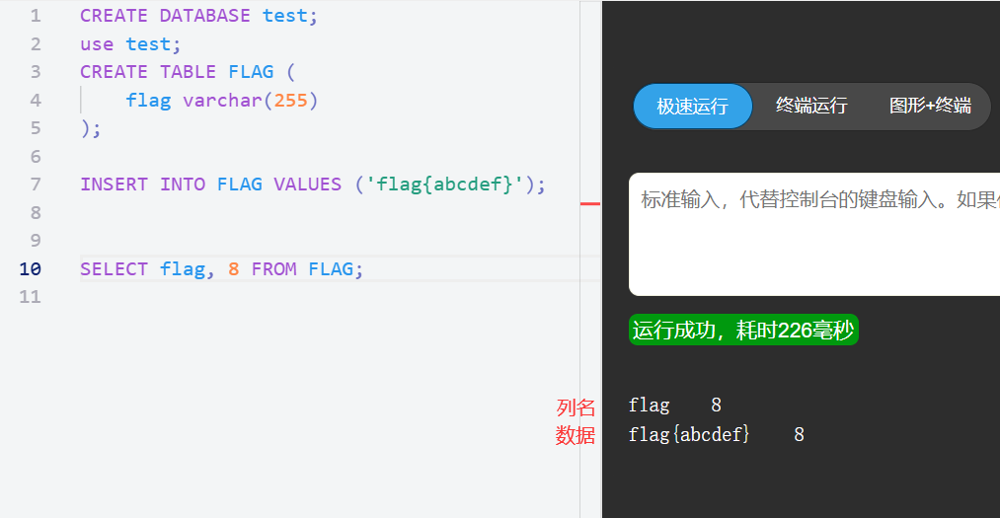
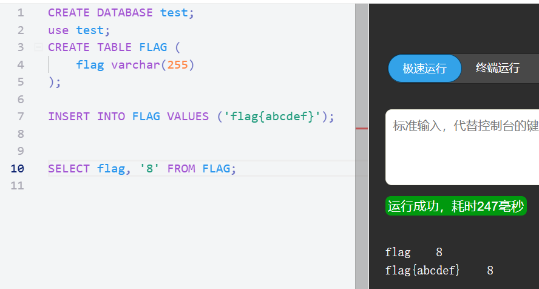
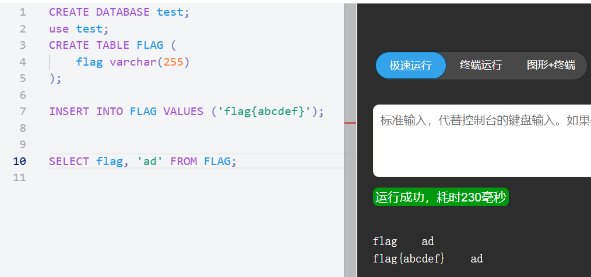
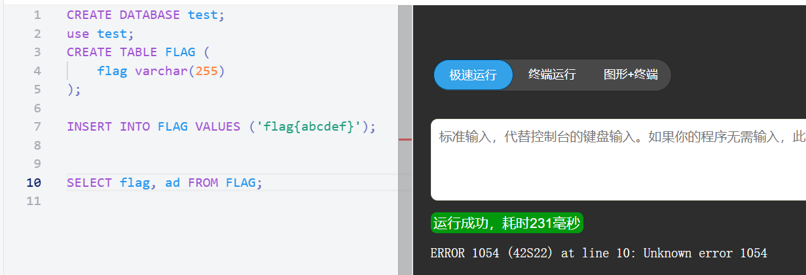
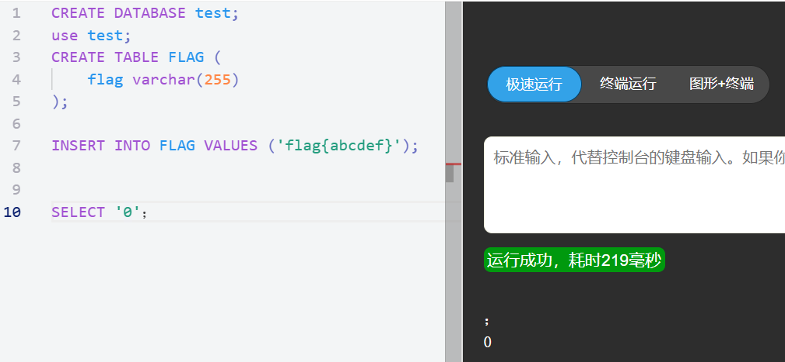
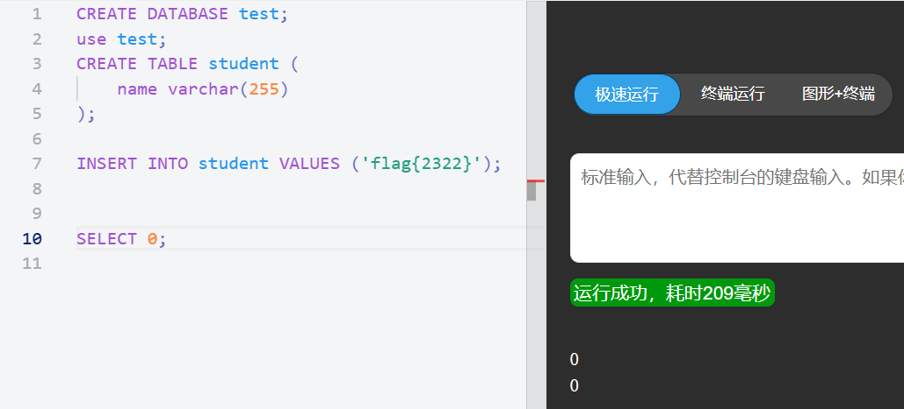

如何猜测SQL注入的后端语句？如何判断SQL注入的数据类型以及闭合符？

<!-- more -->

## 前言

最近做SQL注入的题真的把我CPU弄烧了，特别是猜测SQL语句这一难题。所以这篇博客是为了系统性地总结一下如何初步地判断SQL注入的后端语句，这样之后才能更方便地选择SQL注入方式。

### 一、SQL后端语句原型以及判断方法

#### 1. 经典式SQL后端语句

SQL后端语句是最最常见的类型，基本上大部分的SQL注入题型都是基于该SQL语句的。

该语句如下: 数字型：`select * from table where id=$id`
           字符型：`select * from table where id='$id'`

这是最最常见的SQL后端语句，我们传入的参数就是`$id`。那如何猜测题目出的是哪一种类型呢？后面我会详细说判别方法。

难度高一点的题目也差不多时在这一个基础上修改的，比如多了一个输入密码的参数

如：`select * from table where id=$id and password=$password`

总之就是万变不离其宗。

#### 2. 非经典式SQL后端语句

这里说的非经典式语句，只是我目前遇到比较少的情况（可能自己做题比较少），不过称呼无所谓，只要是要知道有这种情况。

非经典式SQL后端语句: `select $_POST['post'] from table`

对于非经典式SQL后端语句，我们传入的参数就是`$_POST['post']`的内容

该语句有一个特点，当 `select 列名 from table` 时，**如果列名是数字、带引号的字符串(比如8、'8'、'ad')，则会自动地、临时地、增加一列数据，列名与这一列的所有值都为'该值'的；而如果列名是字段（不带引号的字符），则会报错。**

下面我将数据库模拟一下上述情景(**重点是第五种情况**):

1、 传入列名为8,即 `select 8 from table`

为了方便对照我先获取flag列的数据,再进行 `select 8 from table` 再可以看到右下角,生成了一个列名为8,数据为8的新列.原来的FLAG表里并没有8这一列.(注意这个列是暂时地,并不是永久的)

2、 传入列名为'8',即 `select '8' from table`

结果和理论的一样,同样自动生成了新列表,列名为 '8' ,数据为 '8'  的新列(数据类型是字符串类型,和传入8不一样)

3、 传入列名为'ad',即 `select 'ad' from table`

结果和理论的一样,生成了列名为 'ad' ,数据为 'ad' 的新列

4、 传入列名为 ad ,即 `select ad from table`

可以看到右下角结果出现了报错.所以说传入**不带引号的字段**,并且列表中并没有该列名时候,该语句就会报错.

5、 传入列名为 `'0'#` （字符型），或者是`0#`（数字型） 

这里 `#` 为注释符号。

传入列名为 `'0'#` （字符型）后，原语句就变成`select '0'`,因为后面的内容都被注释掉了. 让我们看看结果是什么.

神奇的事情发生了,`select '0'`直接打印出了`0`这一个数据.

再看看传入`0#`（数字型），原语句就变成`select 0`，看看还是不是一样的。

可以看到结果是一样的，所以可以通过测试这两个不同的参数，即`'0'#` 和 `0#` **来判断该SQL语句是字符类型还是数字类型**。

<mark>这个特点有什么用呢?非常重要,可以用来判断后端语句是不是非经典式的.因为这个语句是非今典式独有的!!!!!</mark>

### 二、猜测两种类型语句的方法和步骤

判断之前, **我们先默认是经典式SQL后端语句** ,即`select * from table where id=$id` 或是 `select * from table where id='$id'` .

#### 2.1 判断数字型SQL注入漏洞

先判断字符型，再判断数字型。如果判断字符型时报错，则可知为数字型。

也可以用payload`/?id='#`来判断，正常执行，则为字符型；报错则为数字型

或者用payload`/?id=1+1`来判断(数字型为进行计算)，若网站响应`id=2`的结果，则可知为数字型；反之则为字符型。

##### 2.1.1 **字符型测试步骤(满足以下条件就是字符型):**

1、先进行盲注,尝试0、1、2看看页面有没有回应,有则说明存在SQL注入漏洞.然后我们以参数 1 回应的页面为标准(下面称1为原参数)

2、**原参数加单引号**：`select * from table where name='1'';`

由于加单引号后变成三个单引号，则无法执行，程序会报错；

3、**原参数加 `' and 1=1`** .此时sql 语句为：`select * from table where name='1' and 1=1'`，也无法进行注入，<mark>**还需要通过注释符号将其绕过**</mark>

**因此，构造语句为：`select * from table where name ='1' and 1=1#'` 可成功执行返回结果正确；**

4、**原参数加`' and 1=2#`** .此时sql语句为：`select * from table where name='1' and 1=2#'`则会报错；与原始页面(即参数1时响应的画面)存在差异

如果上面的几步中有一步不满足预期情况，则可以反推知道为数字型

##### 2.1.2 **数字型测试步骤(满足以下条件就是数字型):**

1、先进行盲注,尝试0、1、2看看页面有没有回应,有则说明存在SQL注入漏洞.然后我们以参数 1 回应的页面为标准

2、**原参数加入单引号**.即 `1'` , `URL：xxx.xxx.xxx/xxx.php?id=1'`.  

对应的SQL: `select * from table where id=1';` 这时sql语句出错，程序无法正常从数据库中查询出数据，就会抛出异常；

3、**原参数加入`and 1=1`** , `URL：xxx.xxx.xxx/xxx.php?id=1 and 1=1`

对应的sql：`select * from table where id=1 and 1=1`语句执行正常，与原始页面(即参数1时响应的画面)没有差异；

4、**原参数加入`and 1=2`** , `URL：xxx.xxx.xxx/xxx.php?id=1 and 1=2`

对应的sql：`select * from table where id=1 and 1=2` 语句可以正常执行，但是无法查询出结果，所以返回数据与原始网页((即参数1时响应的画面))存在差异

##### 2.1.3 这里补充几个SQL语句常用注释符号:
   - `#`：不建议直接使用，会被浏览器当做 URL 的书签，建议使用其 URL 编码形式`%23`
   - `--+`：本质上是`--空格`，+会被浏览器解释为空格，也可以使用 URL 编码形式`--%20`
   - `/**/`：多行注释，常被用作空格

<mark>按步骤从上到下一一进行,基本上就可以判断出SQL的注入数据类型是哪一种了.</mark>

<mark>注意:上面的方法对于经典式SQL后端语句,还是非经典式子都能使用,也就是说我们只能判断我们传入的参数是**数字型,还是字符型**. 但还是不知道后端语句是经典式,还是非经典式.</mark>

<mark>那要怎么判断是不是非经典式呢?</mark>

我们观察经典式和非经典式SQL语句的区别(以字符型为例):
   - 经典式:`select * from table where id='$id'` 
   - 非经典式子:`select $_POST['post'] from table`

**可以很明显的看到,经典式的传参是`$id`,取得是列表中某个特定id的数据**

**而非经典式的传参是`$_POST['post']`,相当于列表中的列名**

**我们知道,列表的id一般是从1开始的,很少有`id='0'`的情况**

**而我们的表名是可以取'0'的,取'0'的话,语句就是 `select '0' from table`  . 如果参数再加一个注释符的话,会怎么样呢?这个语句会显示上什么呢?我们刚才讲过了,这是非经典式SQL语句的某个特点,自己回去看看.**

所以我们构造传入参数:
   - 数字型: `0%23` 
   - 字符型: `0'%23`

注释符可以替换其他的

**我们按依次尝试传入参数，如果最终页面没有报错,成功显示出一个数据`0`的话,那么就是非经典式SQL后端语句;反之,如果网页报错,或是没有反应,那么就是经典式SQL后端语句.**

**补充说明一下：只要上面的两种方案有一个成功，则已经表明是非经典式SQL后端语句。如果是数字型的payload成功，则可以知道该SQL语句参数为数字型；若是字符型的payload成功，若成功则可以知道该SQL语句参数为字符型**

#### 2.2 判断Mysql注入闭合方式

这里内容比较抽象,详尽可以参考知识点来源[判断Mysql注入闭合方式](https://blog.csdn.net/aiojay/article/details/130460376)

首先尝试：1.`?id=1'` 2.`?id="`

结果1：如果都报错. 判断闭合符为：**整形闭合**。

结果2：如果单引号报错，双引号不报错。继续尝试
`?id=1'#` (#可以换成其他注释符)

结果2.1：无报错. 判断闭合符为：**单引号闭合**。

结果2.2:报错. 判断闭合符可能为：**单引号加括号**。

结果1.2(1正常,2报错): 如果单引号不报错，双引号报错。继续尝试
`?id=1"#` (#可以换成其他注释符)

结果1.2.1：结果无报错判断闭合符为：**双引号闭合**。

按照以上步骤,按顺序测试即可.

## 结语

东西太多了,写得我累死了..........

反正做题的时候,按着步骤一个一个测试,差不多就能成功.

这里只是教你如何判断SQL后端语句参数的类型，具体下一步要怎么进行注入，我会在其他篇章中进一步介绍。读者也可以自行学习。
