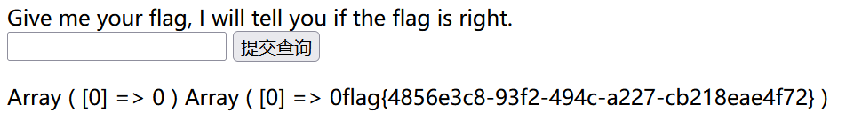

SUCTF 2019 EasySQL1解法

<!-- more -->

## 前言

记录一次SUCTF 2019 EasySQL1刷题记录

### 解法

关键点是判断出SQL后端语句为`select $_GET['query'] || flag from flag` 

可以借助我之前的一篇博客的方法来判断出：[猜测SQL注入的后端语句](https://whitea133.github.io/猜测SQL注入的后端语句/)

判断出SQL语句是非经典式`select $_GET['query'] from flag`  ，并且是数字型的。

后面加入的`|| flag `一定程度上提高了题目的难度，但是知道是非经典式SQL语句。**这种情况如果回显的数据只有 1 或是 0，就可以知道SQL语句拼接了一个逻辑运算符**。可以多测试几个参数，通过判断逻辑运算结果，也可以猜出是进行了一次**或运算** `||`

此外，题目还过滤了select、flag等关键词。进一步提高了难度

所以堆叠注入，联合注入等一系列方法就无法进行。只能通过判断SQL后端语句来进行

#### 法1

知道后端语句是`select $_GET['query'] || flag from flag` 
后

尝试传入参数 `*,1`

SQL语句变成：`select *,1 || flag from flag` 

这里的`1 || flag`是进行了一个**或运算**，结果为`1`。原理是把`flag`看成字符串，先转换为整型类型`0`(因为flag开头没有数字)，再转换为布尔值`False`,而前面的`1`直接转换为布尔值`TRUE`, 最后`TRUE || FALSE = TRUE`。因为SQL中不使用布尔值，所以`TRUE`被转换为`1`.

更加具体的SQL字符串逻辑运算方法可以看我的另一篇博客：[Mysql中字符串的逻辑运算和比较运算](https://whitea133.github.io/Mysql%E4%B8%AD%E5%AD%97%E7%AC%A6%E4%B8%B2%E9%80%BB%E8%BE%91%E8%BF%90%E7%AE%97/)

所以SQL语句又变成：`select *,1 from flag`

该的意思是：先`select * from flag` 再进行 `select 1 from flag`

所以结果如下:

#### 法2

利用**SQL的一个配置**，可以将SQL中的管道符`||`从**或运算**的含义，转换为**拼接**的作用

配置如下 `set sql_mode=pipes_as_concat;`

所以我们构造payload：`0;set sql_mode=pipes_as_concat;select 0`

传入后，原SQL语句变成 `select 0;set sql_mode=pipes_as_concat;select 0 || flag from flag`

分为三段：

1、`select 0;`  ：直接输出数据 0
2、`sql_mode=pipes_as_concat;`  ： 修改**管道符**的作用
3、`select 0 || flag from flag`  ：先`select 0 from flag` 再 `select flag from flag`。最后通过**管道符**的拼接作用，将两者的数据**拼接**起来

结果如下：

## 结语

加油！多刷题0.0
