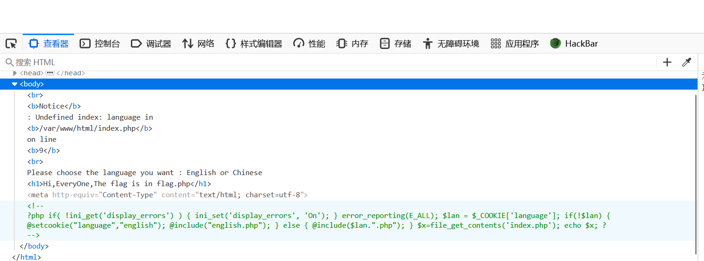
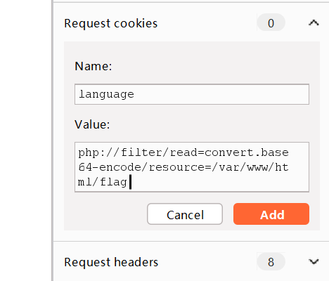
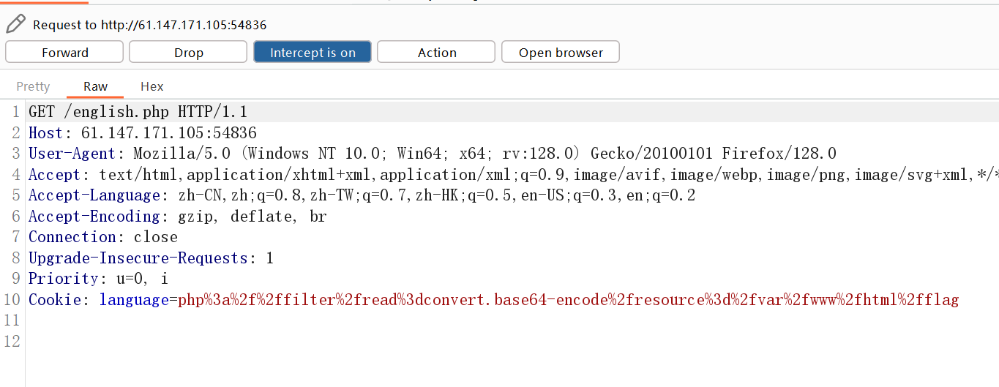
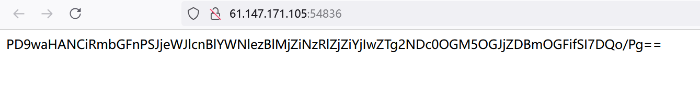
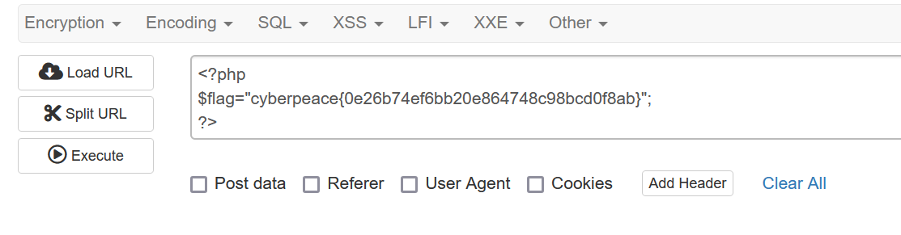

攻防世界fileinclude做题笔记。

<!-- more -->

## 前言

记录一下攻防世界Web新手题fileinclude的做题过程

### 解法

F12查看源代码，可以看到注释里面有PHP代码

<div align=center></div>

内容如下：
```
<?php
if( !ini_get('display_errors') ) {
  ini_set('display_errors', 'On');
  }
error_reporting(E_ALL);
$lan = $_COOKIE['language'];
if(!$lan)
{
	@setcookie("language","english");
	@include("english.php");
}
else
{
	@include($lan.".php");
}
$x=file_get_contents('index.php');
echo $x;
?>
```

代码审计一下：
```
<?php
if( !ini_get('display_errors') ) {  //如果 环境变量未设置错误回显
  ini_set('display_errors', 'On');  //则 开启错误信息回显
  }
error_reporting(E_ALL);         //报告所有类型的错误
$lan = $_COOKIE['language'];    //将cookie中['language']的值赋予lan
if(!$lan)                       //如果变量 lan为0
{
	@setcookie("language","english");
        //向客户端发送cookie（名称为"language"，值为"english"）
	@include("english.php");    //文件包含（调用文件"english.php"）
}
else                            //若不满足上述条件
{
	@include($lan.".php");  //文件包含（调用变量$lan，添加后缀".php"）
}
$x=file_get_contents('index.php');  //将文件 index.php的内容读入变量x中
echo $x;                            //输出 变量x的值
?>
```

这里补充一个点：file_get_contents(文件)可以读取文件并以字符串格式输出，不仅可以读取txt文本，还可以读取html的代码（包括php文件中的html代码）。但是，无法打印php代码。

也就是说可以直接读取一个php格式的文件（里面包含完整的html代码），然后直接echo打印出整个html网页

代码审计之后，可以知道关键就是让网页执行`@include($lan.".php");`

又因为`$lan = $_COOKIE['language']; ` 所以我们要传入COOKIE值，COOKIE名字为'language'

这里我采用burpsuite传入cookie值，我的hackbar不知道为啥用不了

抓包拦截后，在右边可以看到'request cookie'这一个功能

<div align=center></div>

在这里填入

Name:language 

Value:php://filter/read=convert.base64-encode/resource=/var/www/html/flag


<div align=center></div>

Value采取了PHP伪协议的方式，为什么要这样呢？

因为这里的题目考察了本地文件包含(LFI)，即fileinclude。php的代码是无法被包含之后，再打印出来的。

所以必须采用PHP伪协议，先通过base64加密php代码，得到base加密后的字符串。这样，include()之后，再通过`$x=file_get_contents('index.php'); echo $x; ` 这样就可以打印出base64加密后的php代码了，其能够在网页中显示出来

我们得到加密后的字符串，再base64解密，即可得到flag。

我们看看实际效果。添加cookie之后，forward。

<div align=center></div>

结果如下：

<div align=center></div>

base解密即可得到flag

<div align=center></div>

cyberpeace{0e26b74ef6bb20e864748c98bcd0f8ab}

## 结语

fileinclude的题目，很有可能会有用到PHP伪协议，要多注意。
