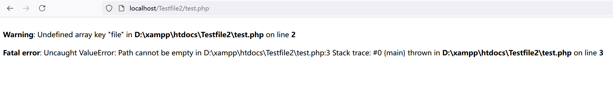
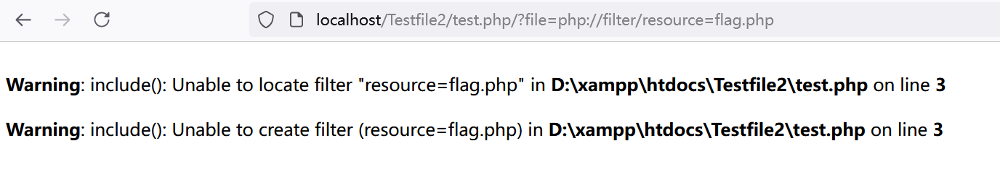
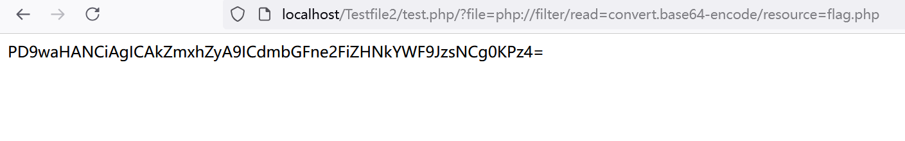
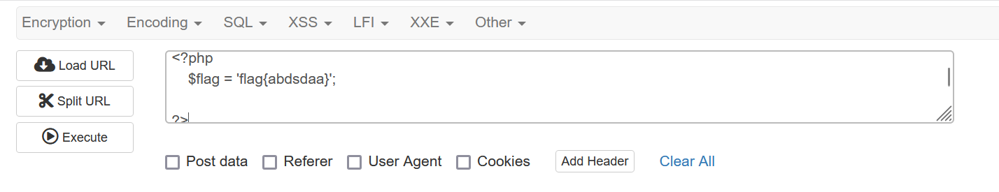

进一步理解include()函数，以及它与php://filter之间的化学反应

<!-- more -->

## 前言

之前对include()函数一直处于似懂非懂的状态，现在经过几次文件包含漏洞的刷题，对include()函数和PHP伪协议有了一个更加深刻的理解

### 1.include函数理解

include函数的功能很简单，就是**直接执行指定文件的代码**

比如 `include(a.php);` 这段代码就会**直接执行a.php文件**里面的所有代码

include函数语法有两种：
   - `include 'filename';`
   - `include($filename);`
  
这里要提一下 `include($filename);`中，文件路径的问题。

官网关于include加载路径解释如下：

被包含文件先按参数给出的路径寻找，如果没有给出目录（只有文件名）时则按照 include_path 指定的目录寻找。如果在 include_path 下没找到该文件则 include **最后才在调用脚本文件所在的目录和当前工作目录下寻找**。如果最后仍未找到文件则 include 结构会发出一条警告；这一点和 require 不同，后者会发出一个致命错误。

这里分析一段奇怪的代码（代码位于a.php文件）：

`include(source.php?/../../../flag.php);`

这段代码是如何包含的呢？

过程如下：

第一步：include函数会先找到`souce.php?`这个文件夹的目录，很明显这种文件夹的名字不存在。**所以include就会以前的php文件为基准，即a.php**

第二步：以当前的文件目录（index.php的文件目录）为基准，按照相对路径继续查找文件，也就是继续进行 `a.php/../../../flag.php`

所以最后的结果就是，会**在a.php文件的上三级目录中去找flag.php文件**

### 2.include()函数与php://filter的结合

当**php://filter与包含函数include()结合时**，**php://filter流会被当作php文件执行**。所以我们一般对其进行编码，让其不执行，从而导致任意文件读取。

以 `include(php://filter/read=convert.base64-encode/resource=flag.php)` 为例

我们知道， `include()` 本应该是要传入一个文件的，而这里的**php://filter流就可以当作一个文件传入到include()函数中去, 并且执行这个php://filter流的命令**

这里有两个效果大致相同的代码：
   - `include(flag.php);` 
   - `include(php://filter/resource=flag.php);`

这两个效果其实差不多，只不过一个是**直接利用include()函数直接执行**，另一个是**通过php://filter流来作中间量**,传入include()中执行

**第二个代码我试了一下，发现会报错**，应该 `php://filter/resource=flag.php` 并不算一个完整的php://filter代码，缺少了过滤器

但是有个问题，我们不想要执行代码文件，我们想要的是获取到**flag.php文件**中的源代码。

**所以我们就要利用filer流过滤器中，base64加密（或者其他加密类型）的方法，来使得include()函数无法执行命令**，毕竟我们都让php源代码变成base64编码了，**include()函数难不成还看得懂base64加密后的看代码去执行？**。

注意一下，这里有个include()的特点，**虽然include()无法执行加密后的代码，但是它会直接打印出源代码在网页中国，这个非常重要！！！**

这里我做了个测试看看效果是不是这样:

test.php代码：

```
<?php
    $file = $_GET['file'];
    include($file);
?>
```

flag.php代码:

```
<?php
    $flag = 'flag{abdsdaa}';
?>
```

我们在test.php网页中，页面如下：

<div align=center></div>

出现了报错，让我们传入file参数

我们传入payload:`/?file=flag.php `结果如下

<div align=center></div>

可以看到没有报错，但是一片空白。

原因是include()函数的执行了 `$flag = 'flag{abdsdaa}';` 这一段代码，也就是定义了一个变量。然后就没什么事情了

我们传入payload：`/?file=php://filter/resource=flag.php`

结果如下：

<div align=center></div>

再次报错，提示说是没有`resource=flag.php`过滤器

最后我们不想让**include()函数**执行flag.php中的代码，**我们的目的是想看看flag.php的源代码是什么样的**

那我们就传入payload: `/?file=php://filter/read=convert.base64-encode/resource=flag.php`

结果如下：

<div align=center></div>

可以看到include()函数，**不仅没有执行flag.php中的的代码，还帮我们打印出了base64编码加密后的flag.php代码**

base64解密之后即可得到flag.php的源代码

如下：

<div align=center></div>

## 结语

这一次算是理清了include()这个函数与php://filter之间的化学反应
