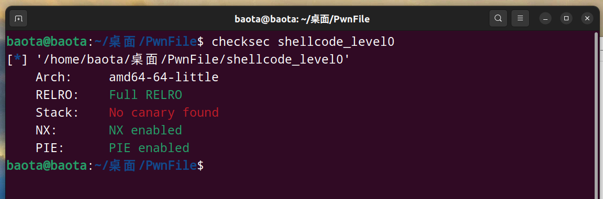

BaseCTF新生赛，尝试做做PWN题

<!-- more -->

## 前言

尝试做做PWN题目

### 1. [Week1] 签个到吧

究极基础题，nc一波，cat一下就行了

BaseCTF{be60ff6a-2e27-45c0-903f-6026c5e95ea4}

### 2. [Week1] echo

这道题要利用echo来输出文件内容

具体方法参考如下[如何用echo输出文件内容](https://blog.csdn.net/u014250897/article/details/113748196)

使用方法如下：`echo "$(<fileName)"`

补充：如果一个文件是unicode编码，则利用下面这条命令，可以转化为中文。 

补充的命令：`echo -e "$(<fileName)"`

具体操作如下：

这里题目只允许用`echo`命令，`ls`命令用不了

这里有个小技巧就是利用`echo *`，和`ls`功能一样。

大概步骤就如上图所示

BaseCTF{e6a529c3-3350-464c-9a5f-81a8ef2a35ca}

### 3. [Week1] Ret2text

这道题是栈溢出的题目，下载附件看看

先`checkesc 文件`一下，看看有没有什么保护

可以看到栈没有保护

IDA反编译一下文件，看看代码

主函数如下：

可以看到有`read`函数，可以用来利用栈溢出漏洞

接下来，找找`buf`的**地址以及返回地址**

分别是`0x20`和`0x8`,由此可以计算出偏移地址

然后再找系统命令的地址，也就是`/bin/sh`指令的地址：`0x4011BB`

最后写一个exp就可以搞定

exp如下：

python3运行一下exp

最后再`ls`,`cat flag`即可

BaseCTF{b64dce26-b050-45ae-87b3-c1c73c25e54f}

### 4. [Week1] shellcode_level0

checksec一下,64位的系统:

IDA反汇编一下：

看到有一个read()函数，题目大概就是让我们写一个shellcode，让后read函数读取，最终得到shell权限.

利用`asm(shellcraft.sh())`生成一个shellcode即可

exp如下：

python运行exp得到权限,`cat flag` 即可

BaseCTF{77160d94-72a4-48fd-a163-ecef8a3352ac}

### 5， [Week1] 我把她丢了

这题不太会，看的WP

checksec:

IDA反编译：

主函数套了个vuln函数，函数还有个read()可以栈溢出

因为没有机会输入，所以要通过ROP来利用制造出`system(/bin/sh)`指令

关键是找到利用`pop rdi`和`ret`，用**ROPgadget**工具可以快速找到我们想要的`gadget`

命令如下：`ROPgadget --binary 文件名 --only "pop|ret"`

获得到的**gadget**：

然后写ROP的exp即可，注意这里要进行**system函数的栈平衡**（在64的程序文件中，system函数的内存地址必须要16字节对齐，即内存地址末端必须是0，而不是8）

这里的system函数的内存地址，**是指其放在栈中的地址**。（**栈容量的单位为 “字宽”，对于 32 位虚拟机来说，一个” 字宽 “占 4 个字节，对于 64 位虚拟机来说，一个” 字宽 “占 8 个字节。**）

比如下面红色括号包括的地址，就是**栈地址**

**可以看到储存地址的每一个字宽都占8个字节。比如s，就是从地址0x00到0x08，共八个字节（8 dup）; r 也同理,从地址0x08到0x10,共八个字节(8 dup)。**

**之后会再分配给buf参数一定字节的空间大小（不一定是8字节的倍数，所以有时候buf的地址末端不是0，也不是8）**

**所以我们常常会对buf填充垃圾数据（填到s），同时加上8个字节的偏移量，就能快速到达返回地址的位置**

具体知识点可以看一下文章[system函数的栈平衡](https://www.cnblogs.com/ZIKH26/articles/15996874.html)

exp如下：

执行后，同样的套路得到flag

BaseCTF{80099f51-e4f6-4786-a021-c831e7d97820}

### 6. [Week1] 彻底失去她

checksec:

IDA反编译：

查看主函数，有read可以栈溢出，但是查看可以发现有`system函数`但是没`/bin/sh`字符串来使用

所以我们可以利用`bss段`来自己生成一个字符串，通过read()把`/bin/sh`读入到`bss段`里面

下一步就是和上一题一样,`pop rdi + bss段的地址（储存了字符串/bin/sh）+ system函数的地址`

同样要注意要不要进行`system函数的栈平衡`

我们自己需要构造一个read函数，构造成read(0,buf,0x10)函数要用到三个参数，所以我们要控制三个寄存器，按顺序分别是`rdi、rsi、rdx`

和上一道题一样，用工具找到ROPgadget找可以用的gadget。

结果如下：

说一下这里**read的第三个参数为什么是0x10**

其实read的第三个参数表示的是读取内容的最大字节数(byte)

0x10其实就是一个数字，转到十进制就是16，也就是说read(0,buf,0x10)规定了读取的内容最大字节数为16个字节。

AI解释如下：

其实我们在这道题中，也可以规定为read(0,buf,0x08)，也就是最大为8个字节

因为，我们要传入的字符串`/bin/sh\x00`为8个字节（一个字符一个字节，\x00 也表示一个字节）

AI说明：

只要读取的内容不超过规定自己规定的字节数即可。

`bss字段`的地址：

AI说明：

每一个小黄条可以储存一字节的字符

思路出来了，找东西，拼ROP链条,写exp即可:

AI说明：

这里的第15行，`payload+=p64(pop_rsi_ret)+p64(bss)`

目的是改变下一个read函数，即后面`read(0,buf,0x10)`。改变其buf起始地址为bss的地址。

这样我们后面`io.sendline(b'/bin/sh\x00')`所传入的字符串就就会被read()函数读入到`bss字段`的位置中去

exp大概的进行过程就是：

1. 构造完payload后，第一次`io.sendline(payload)`，将payload的内容传入到最外面的`read(0, buf, 0x100uLL)`中
2. 当进行到`p64(read) #read(0,buf,0x10)`这一步的时候，又会跳转进入到我们自己构造的`read(0,buf,0x10)`，此时程序会要求我们输入内容
3. 第三步，程序传入`io.sendline(b'/bin/sh\x00')`
4. 第四步，程序接到我们的内容后,`read(0,buf,0x10)`执行完毕，随后完成后续的所有操作 `p64(pop_rdi_ret)+p64(bss)+p64(system)`

最后得到指令权限，cat flag即可

BaseCTF{03549f5a-19c8-4a77-98c0-26b2426ce390}

## 结语

作死打pwn，后悔0.0。入门好难
