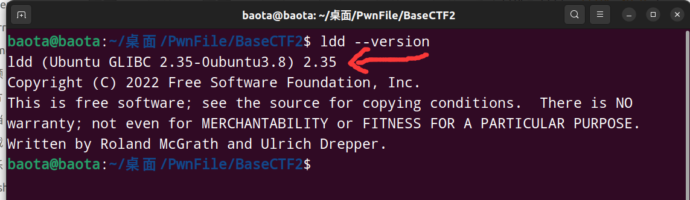
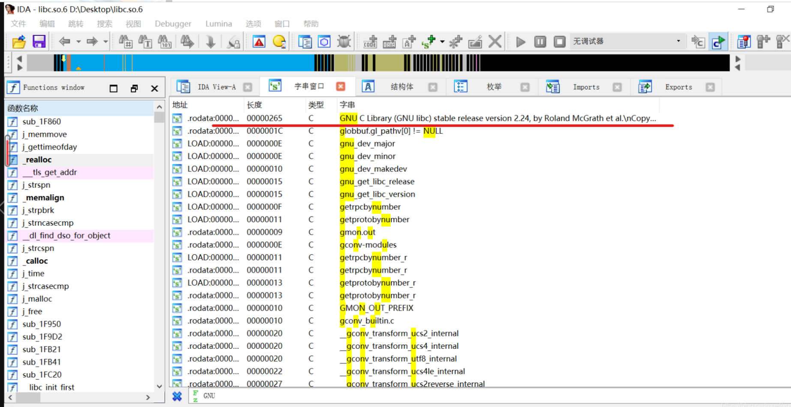

我们知道做retlibc题目一定要注意libc版本一不一样，那我们要这么看libc版本呢？

<!-- more -->

## 前言

上一篇文章我讲了做retlibc题目为什么要注意libc版本和本地的一不一样，现在我告诉大家这么判断两个libc版本一不一样

相关知识可以参考以下文章：

[CTF-PWN中patchelf更换libc和ld的完整详细过程](https://blog.csdn.net/llovewuzhengzi/article/details/134234465)

### 判断的方法

#### 1. 判断本地默认的libc版本（可执行程序默认使用的libc）

使用`ldd --version`即可

**ldd --version**使用后的结果如下：

这里可以看到我当前ubuntu系统默认使用的**libc版本是2.35**

### 2. 判断题目附件（远程靶机）给的libc.so.6的版本

使用`strings ./libc.so.6 | grep "Ubuntu GLIBC"`即可

使用`strings ./libc.so.6 | grep "Ubuntu GLIBC"`后的结果如下：

可以看到题目给的libc.so.6，他的版本号也是2.35

所以远程靶机和我的虚拟机默认使用的libc版本号是一致的

这时候即使我不使用**patchelf去修改可执行程序使用的libc版本**，同样可以本地和远程同时打通。

这里我补充**另一种**查看题目附件libc.so.6的版本的方式:

**就是使用ida打开libc.so.6,然后在字符串窗口搜索GNU就好了**

具体使用结果如下：

该方法参考至[pwn 查看陌生libc的版本](https://blog.csdn.net/yongbaoii/article/details/114908022)

## 结语

以上内容参考引用了[PWN题获取细分版本libc方案](https://bbs.kanxue.com/thread-271926.htm)
